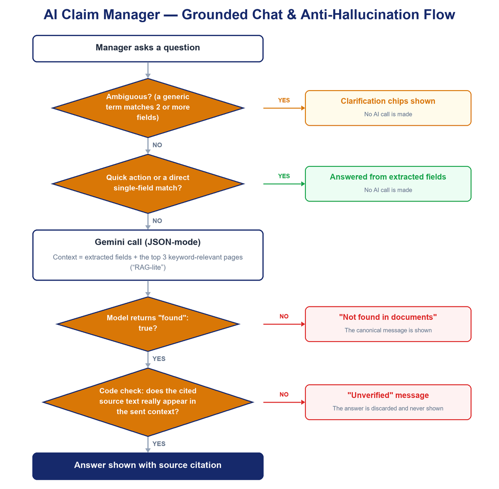
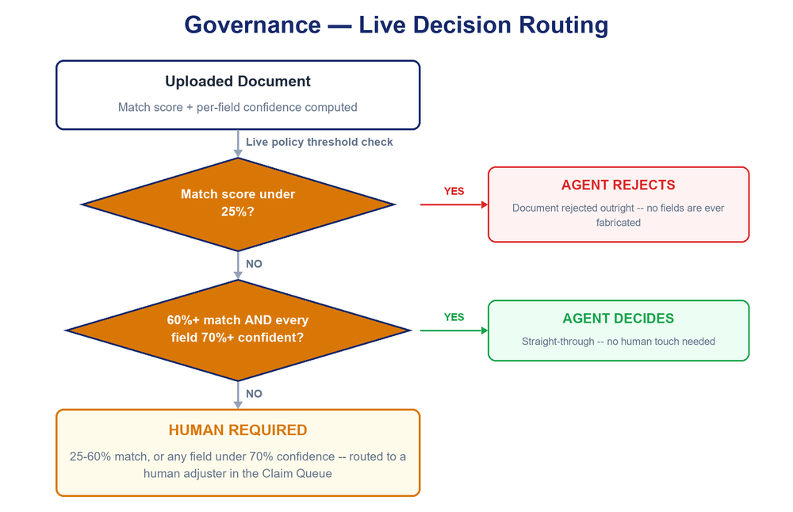
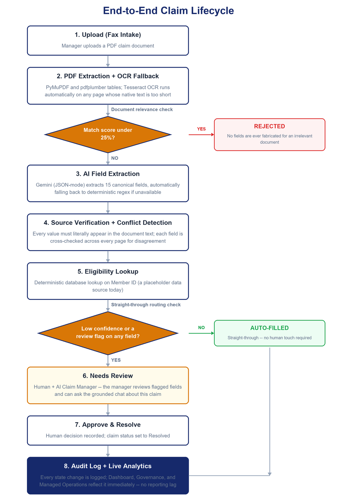
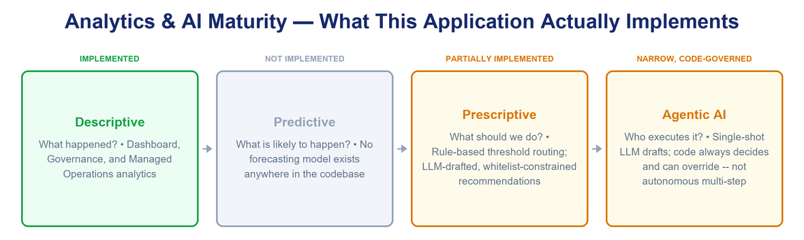
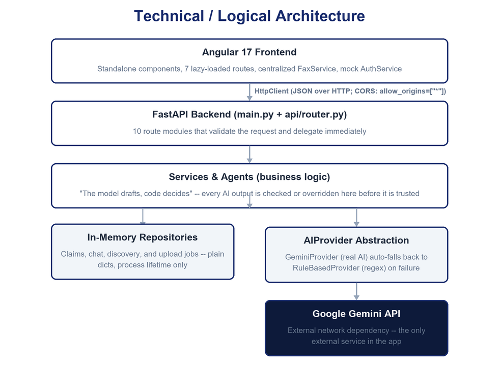

# Medical Command Center – AI-Powered Application Analysis, Architecture & Hackfest Client Showcase

> **Naming note:** The application is branded **"Medical Command Center"** in its own UI header and sidebar. Its backend API is titled `Insurance Claim Intake API` (FastAPI, v0.2.0), and the repository is named `insurance-fax-app`. All three names refer to the same single application. This document uses "Medical Command Center" (or "the application") throughout.

> **Methodology note:** Every claim in this document is derived directly from the current source code (frontend: Angular 17.3 under `frontend/src/app/`; backend: FastAPI under `backend/app/`). Where a capability could not be confirmed in code, it is explicitly labeled **"Not confirmed from the current implementation."** Marketing/business figures that originate from the separate Hackfest pitch deck (`Legacy_to_Agent_Transformation_Factory`) — e.g. market-size or cost-reduction ranges — are labeled as **aspirational GTM targets**, not measured results of this application, because no telemetry or benchmark exists in the codebase to substantiate them.

---

## 1. Executive Summary

**Application name:** Medical Command Center (Insurance Claim Intake & AI Transformation Platform)

**Purpose:** Medical Command Center automates the intake and adjudication-support workflow for insurance claim documents ("faxes") — from PDF upload through AI-assisted field extraction, human review, and approval — and packages the same underlying agent-transformation methodology into a set of consulting/sales tools (Growth Studio, Governance, Managed Operations) that let Zuci demonstrate the "Legacy-to-Agent Transformation Factory" narrative live, on real data, instead of only in slides.

**Business problem addressed:** Manual claim intake is slow, inconsistent, and labor-intensive — a human has to read every faxed document, retype 15+ fields, cross-check them against the source, and decide whether the claim is straight-through or needs escalation. Medical Command Center automates the extraction and verification steps and reserves human attention for genuine exceptions.

**Target users:** Internal claim operations staff / clinical administrators processing inbound claim documents, plus (via Growth Studio/Governance/Managed Operations) a secondary audience of business/technical stakeholders evaluating the agent-transformation approach itself.

**Main user role (as implemented):** A single mock role, `Clinical Admin`, is the only role that exists in the running application (see §6 and §13 for why this is a UI-only concept today, not enforced RBAC).

**Major capabilities (implemented today):**
- PDF claim-document upload with automatic OCR fallback for scanned/faxed pages
- AI-assisted extraction of 15 canonical claim fields, each with confidence score, verified source text, and cross-page conflict detection
- Deterministic document relevance/validity scoring that rejects or flags irrelevant documents before any field is shown
- A grounded, hallucination-resistant AI chat assistant ("AI Claim Manager") scoped to the selected claim, with voice input/output and a lip-synced avatar
- A human review & approval workflow (approve & resolve, delete/restore, re-run extraction)
- A live operations Dashboard (claims, financials, trends, quality, audit trail) computed entirely from real claim data
- **Growth Studio** — a process-automation consulting toolkit: Discovery assessment → Architecture recommendation → Agent simulation → ROI calculator → Revenue-opportunity calculator
- **Governance** and **Managed Operations** pages — live views of the real confidence/match-score policy thresholds, decision-authority split, audit trail, and system throughput
- A **Transformation Factory** funnel embedded on the Dashboard, linking the whole "Discovery → Blueprinting → Implementation → Governance → Managed Operations" narrative to the actual working features behind each stage

**AI capabilities:** Google Gemini (configurable model, default alias `gemini-flash-latest`) for structured field extraction, grounded chat, and structured-JSON drafting (Discovery assessments, agent-simulation drafts) — always backed by a zero-dependency deterministic rule-based fallback so the app never goes fully offline if no AI key is configured or the AI call fails. See §7–§9 for full detail, including an honest assessment of what is *not* "agentic AI" in the strict sense.

**Key workflows:** Upload → Extract → Verify → Review/Approve (claim intake); Describe a process → Get an agent-suitability score → Simulate it against a real claim → Model ROI/Revenue (Growth Studio); View policy thresholds, decision splits, and audit trail (Governance); View live throughput/quality (Managed Operations).

**Business value:** Faster, more consistent first-pass claim data capture; a visible, explainable decision trail (which thresholds decided what, and why); a reusable, live demo of the broader "Transformation Factory" methodology that doesn't require separate slideware to prove the model works.

**Technical highlights:** Clean service-layer separation (routers → services → agents/repositories); every AI call sits behind a provider abstraction with an automatic deterministic fallback; every "agentic" decision that matters for compliance (thresholds, whitelists, escalation) is enforced in Python code, never left to model behavior alone; consistent error-handling contract across the whole API; an existing automated test suite (12 files, ~2,236 lines) covering the API, chat, discovery, extraction, PDF service, ROI/revenue math, and upload pipeline.

**What makes it valuable for the client:** It is simultaneously (a) a working claim-intake product and (b) a live, honest proof point for the "agents execute, humans govern" pitch — the same application that processes a claim can also show, on the same running instance, the governance thresholds and audit trail that make that automation defensible to a compliance-minded buyer.

### 30-Second Elevator Pitch

> "Medical Command Center takes a faxed insurance claim, reads it automatically — including OCR for scanned pages — pulls out every field an adjuster needs, checks each value against the original document so nothing is invented, and only asks a human to step in when confidence is genuinely low. The same platform doubles as a live demonstration of our agent-transformation methodology: you can watch a real claim get triaged, see exactly which policy threshold decided that outcome, and see the audit trail that proves it — all without leaving the app."

---

## 2. Business Problem

### Existing/manual challenges
- A human must open every faxed/scanned claim document and manually retype up to 15 fields (patient, policy, hospital, dates, financial amounts).
- Faxed documents are frequently low-quality scans with no text layer, requiring manual reading or ad-hoc OCR tooling.
- Cross-checking a value against the original document (to catch OCR/typo errors) is tedious and often skipped under time pressure.
- When the same document contains two different values for the same field (e.g., a claim amount that appears twice, differently), there's no systematic way to catch it.
- Deciding "is this document even a valid claim?" is subjective and inconsistent between reviewers.

### Data-related challenges
- Claim data arrives as unstructured PDF/fax text, not structured data.
- There is no single place where a manager can ask a plain-language question about a claim and get a grounded, sourced answer instead of re-reading the whole document.

### Decision-making challenges
- Deciding whether a claim can be auto-processed or needs a human requires consistently applying confidence/relevance thresholds — hard to do by eye, every time, across every claim.

### Reporting/analytics challenges
- Without a live dashboard, operational visibility (how many claims are queued, how many need review, where documents are being rejected and why) requires manual counting.

### Communication/business-development challenge (the "Transformation Factory" side)
- Explaining an "agent transformation" methodology to a client is normally done with static slides — there's no way for the client to see the actual governance thresholds or a live agent simulation, only a narrative.

### Before → Application → After

> **Before:** A reviewer manually reads a faxed claim document, retypes 15 fields, cross-checks them by eye, and decides — inconsistently — whether the claim needs escalation.
>
> **Application:** Medical Command Center extracts the same 15 fields automatically (AI-assisted, with a deterministic fallback), verifies each value against the source text, flags cross-page conflicts, and applies configurable relevance/confidence thresholds to route the claim.
>
> **After:** The reviewer sees a pre-filled, source-verified claim with only the genuinely uncertain fields flagged, and can ask the AI Claim Manager plain-language questions about it before approving.

> **Before:** A sales/consulting team pitches "AI agents will govern your claims process" using only slides.
>
> **Application:** The same running platform shows the real confidence thresholds that decide "agent can decide" vs. "human required" (Governance page), and lets a prospect watch an agent simulation run against a real, already-processed claim (Growth Studio → Implementation).
>
> **After:** The pitch is backed by a live, inspectable system rather than a narrative alone.

---

## 3. Solution Overview

Medical Command Center is a two-tier web application:

- **Frontend:** Angular 17.3 (standalone components, no NgModules), TypeScript, SCSS with a centralized CSS-variable design-token system (`frontend/src/styles.scss`) supporting light/dark themes.
- **Backend:** FastAPI (Python), organized as `routers → services → agents/repositories`, with all data held in-memory (no database) and all AI calls routed through a single provider abstraction.

The solution is delivered as one Angular app with seven routed areas (Login, Dashboard, Fax Intake/Claim Queue, Growth Studio, Governance, Managed Operations, plus the wildcard redirect) and a floating AI assistant widget available wherever a claim is open.

---

## 4. Application Modules

| Module | Purpose | Main Users | Key Features | AI Usage | Business Value |
|---|---|---|---|---|---|
| **Authentication (mock)** | Gate access to the app | Clinical Admin (single mock role) | Login form, session in `localStorage`, route guards | None | Prevents casual/unintended access during demos; **not production security** (see §12) |
| **Dashboard** | Operational overview + entry point to the Transformation Factory narrative | Clinical Admin | KPI tiles, financial summary, trend chart, status distribution, provider table, quality analytics, recent activity, attention list, embedded 5-stage funnel | None directly; displays outputs of AI-assisted extraction | Single-glance visibility into claim throughput and quality |
| **Fax Intake / Claim Queue** | Upload, extract, review, approve/reject claim documents | Clinical Admin | Upload with real per-stage progress, field-by-field review with confidence, source, and conflict validation modals, approve & resolve, delete/restore, reprocess | Gemini (or rule-based fallback) field extraction; embeds the AI Claim Manager chat | Core claim-processing workflow — the product's primary value driver |
| **AI Claim Manager** (floating widget) | Grounded Q&A about the currently open claim, with voice I/O | Clinical Admin | Quick-action chips, free-form chat, ambiguity clarification, TTS playback with lip-synced avatar, STT input | Gemini grounded chat (or a "not configured" message when unavailable) | Reduces re-reading of source documents; answers are provably grounded, never invented |
| **Growth Studio** | Assess *any* business process for agent-automation fit, simulate it, and model ROI/Revenue | Clinical Admin (demo/consulting use) | 5-tab pipeline: Discovery, Architecture, Implementation (simulation), Impact (ROI), Revenue | Gemini structured-JSON drafting (Discovery, Implementation) with deterministic fallback and code-enforced whitelists | Turns the sales pitch into a working, on-data demo tool |
| **Governance** | Show the real policy thresholds and decision-authority split | Clinical Admin (demo/compliance use) | Live thresholds, decision-authority breakdown, explainability/auditability metrics, compliance checklist, audit trail | None (pure data view over real config + real claim data) | Makes "human oversight, explainability, auditability, compliance" concrete rather than a slide bullet |
| **Managed Operations** | Show live system health and throughput | Clinical Admin (demo/ops use) | System status, throughput KPIs, confidence-quality bar, link to full Dashboard | None (data view) | Frames the platform as a "24×7 digital workforce" backed by real numbers, not a mockup |

---

## 5. Individual Page-by-Page Analysis

### Page: Login (`/login`)

**5.1 Purpose:** Gate the application behind a sign-in screen for demo/dev purposes.

**5.2 Target User:** Anyone with the single hardcoded dev credential (`test1@gmail.com` / `12345678`). There is no self-registration and no other account.

**5.3 Page Overview:** A full-bleed split screen (login form) rendered without the app's normal header/sidebar (`AppComponent.isLoginPage` hides the shell chrome on this route).

**5.4 UI Sections**
| Section | Purpose | Data Source | API Used | AI Involvement |
|---|---|---|---|---|
| Email/password form (Reactive Forms) | Collect credentials | User input | None | None |
| Inline validation messages | Required/email-format feedback | Angular `Validators.required`/`Validators.email` | None | None |
| Show/hide password toggle | UX convenience | Local component state | None | None |
| Submit button (loading state) | Trigger login | — | `AuthService.login()` (frontend-only, no HTTP call) | None |

**5.5 User Actions:** Submit (attempts mock login), toggle password visibility.

**5.6 Input → Processing → Output**
```text
User types email/password
    ↓
Angular Reactive Forms validation (required, email format)
    ↓
AuthService.login(email, password) — pure frontend check against ONE hardcoded credential
    ↓
On match: session object {email, role: "Clinical Admin", loginAt} written to localStorage; authenticated$ = true
    ↓
Router navigates to returnUrl or /dashboard
    ↓
On mismatch: "Invalid email or password." shown inline
```
This entire flow is **frontend-only** — `frontend/src/app/services/auth.service.ts` never calls the backend. In a production build (`environment.production === true`), the mock-credential branch is skipped entirely and login **always fails closed**, because no real `/api/auth/*` endpoint exists in the backend.

**5.7 APIs:** None. This page makes zero backend calls.

**5.8 Database:** None — session state lives only in browser `localStorage` (`mock_auth_session` key).

**5.9 AI/ML Usage:** None.

**5.10 Business Value:** Demonstrates a login gate for demo purposes; **not a substitute for real authentication** (see §12, §24).

**5.11 Demo Talking Points**
1. This is a development-mode gate, not production auth — worth saying proactively rather than waiting for the client to ask.
2. It fails closed in a production build, by design — the team chose not to fake a backend contract that doesn't exist yet.
3. Session persists across refresh via `localStorage`, so a demo doesn't require re-login every time.

---

### Page: Dashboard (`/dashboard`)

**5.1 Purpose:** The default landing page after login — an at-a-glance operational view of claim volume, financials, quality, and the Transformation Factory narrative.

**5.2 Target User:** Clinical Admin (all authenticated users — no role-based variation exists).

**5.3 Page Overview:** A single scrolling page: page header with filter/export controls → embedded Transformation Factory funnel panel → collapsible filter bar → KPI grid → financial summary → trend chart + status distribution (two-column) → insurance-provider table + document/AI quality grid (two-column) → recent activity + attention-required (two-column) → quick actions.

**5.4 UI Sections**

| Section | Purpose | User Interaction | Data Source | API | AI Involvement |
|---|---|---|---|---|---|
| **Legacy-to-Agent Transformation Factory panel** | Present the 5-stage commercialization funnel as clickable navigation into the underlying live features | Click a stage card to open it | Static copy (stage titles/descriptions) from the Hackfest deck; links are real Angular routes | None (client-side navigation only) | None |
| Filter bar | Scope the dashboard by date range, status, insurance provider, confidence bucket | Select filters, Apply/Reset | `FaxService.getInsuranceProviders()` for the dropdown | `GET /api/dashboard/providers` | None |
| KPI grid | Headline counts (Total, Queued, Pending Review, Resolved, Invalid, Documents Processed, High/Low Confidence Fields) | Click a tile to jump to the matching queue filter | `DashboardOverview.summary` / `.documentAnalytics` / `.quality` | `GET /api/dashboard/overview` | None (displays outputs of prior AI extraction) |
| Financial summary | Total, Approved, Pending, and Rejected claim value | — | `DashboardOverview.financial`, parsed from the `claimAmount`/`approvedAmount` extracted fields | same as above | None |
| Claims Processing Trend (CSS-bar chart) | Daily submission volume | — | `DashboardOverview.trends` | same | None |
| Claim Status Distribution | Real percentage breakdown by status | — | `DashboardOverview.statusDistribution` | same | None |
| Top Insurance Providers table | Per-provider claim counts/value | Click a row to filter by that provider | `DashboardOverview.insuranceProviders` | same | None |
| Document & AI Quality grid | OCR, confidence, and source-mapping metrics | — | `DashboardOverview.quality` / `.documentAnalytics` | same | None |
| Recent Claim Activity table | Real audit-log entries | Click a row to open that claim | `DashboardOverview.recentActivity` | same | None |
| Attention Required list | Claims with the highest-priority open issues | Click "Review" to open the claim | `DashboardOverview.attentionRequired` | same | None |
| Quick Actions | Shortcuts into the queue views | Click | — | — | None |

**5.5 User Actions:** Apply/Reset filters, Export CSV, Refresh, click any KPI/table row to navigate, click a Transformation Factory stage card.

**5.6 Input → Processing → Output**
```text
Page load / filter change
    ↓
FaxService.getDashboardOverview(filters) → GET /api/dashboard/overview
    ↓
Backend: claim_repository.list_all() + list_audit_log()
    ↓
analytics_service.build_overview() computes summary, financial, statusDistribution,
documentAnalytics, quality, insuranceProviders, trends, recentActivity, attentionRequired
    — every number derived from real claim records, nothing fabricated
    ↓
JSON response → Angular renders KPI tiles / charts / tables
    ↓
User clicks a tile/row → router navigation to /queue/:filter[/:id] or a funnel stage
```

**5.7 APIs**
| API | Method | Purpose | Auth |
|---|---|---|---|
| `/api/dashboard/overview` | GET | Full filtered analytics payload | None |
| `/api/dashboard/providers` | GET | Distinct insurance providers seen in claim data | None |
| `/api/dashboard/export` | GET | CSV export of the filtered claim set | None |
| `/api/dashboard/attention-summary` | GET | Lightweight version used by the header notification bell | None |

**5.8 Database:** No real database — reads the in-memory `ClaimRepository` (`backend/app/repositories/claim_repository.py`), which holds `_claims: dict[str, dict]` and `_audit_log: list[dict]` for the lifetime of the backend process only.

**5.9 AI/ML Usage:** None on this page directly. Every figure shown is a deterministic aggregation (Python `analytics_service.py`) over data that *was* produced by AI extraction earlier in the pipeline.

**5.10 Business Value:** Gives an operator instant visibility into throughput and quality without manual counting, and gives a Hackfest audience a single screen that ties the sales narrative (the funnel) directly to live operational data.

**5.11 Demo Talking Points**
1. Every number on this page is computed live from the claim database — there is no mock/sample data path.
2. The Transformation Factory funnel isn't decorative — each card is a real link into a working feature.
3. Point out the "0%"/"0 claims" honesty when the in-memory store is empty (e.g., right after a backend restart) — the system reports true zero states rather than faking numbers, which is a credibility point worth calling out live.
4. CSV export and provider drill-down show this isn't just a static mockup dashboard.

---

### Page: Fax Intake / Claim Queue (`/queue/:filter` and `/queue/:filter/:id`)

**5.1 Purpose:** The core claim-processing workflow — upload a document, review AI-extracted fields, resolve conflicts, and approve the claim.

**5.2 Target User:** Clinical Admin.

**5.3 Page Overview:** A left-hand queue list (filtered by route param: all / needs_review / resolved / queued / invalid / deleted) plus, when a claim is selected, a two-panel detail view: Claim Information (editable field grid) and Source Document (raw text with highlight-on-demand). The floating AI Claim Manager widget is present on this page only.

**5.4 UI Sections**

| Section | Purpose | Data Source | API | AI Involvement |
|---|---|---|---|---|
| Upload bar | Upload a PDF | User file input | `POST /api/faxes/upload-async` then poll `GET /api/faxes/upload-status/{jobId}` | Triggers the full extraction pipeline (§6) |
| Real upload progress | Show true per-stage pipeline progress (uploading → OCR/extracting → checking relevance → AI extraction → verifying → eligibility → finalizing) | Backend-reported stage/percent via polling every 400ms | same as above | Reflects real AI-extraction stage, not a fake progress bar |
| "Scanning" digit flourish | Decorative visual only | Random client-side hex digits | None | **Explicitly documented in code as decorative, never presented as a real measurement** |
| Queue list | Browse/select/delete/restore documents | `FaxSummary[]` | `GET /api/faxes?status=` , `DELETE /api/claims/{id}`, `POST /api/claims/{id}/restore` | None |
| Validation modal (invalid) | Hard-stop when a document fails relevance scoring | `document.status === 'invalid'` | — | Reflects `DocumentRelevanceService` (rule-based, not AI) |
| Validation modal (review required) | Soft-stop requiring explicit "Review Anyway" | `document.status === 'review_required'` | — | same |
| Claim Information panel | Editable 15-field grid with per-field confidence, source-page link, conflict, unverified, and manager-verified badges | `FaxRecord.fields` | `GET /api/faxes/{id}` | AI (or rule-based) extraction output, source-verified in code |
| Source Document panel | Raw extracted text with highlight of the exact source snippet for a field | `FaxRecord.raw_text`, `.pages` | same | Highlights use the literal `sourceText` the AI/regex returned |
| Action bar | Re-run Extraction, Approve & Resolve, Delete | — | `POST /api/documents/{id}/reprocess`, `POST /api/faxes/{id}/decision`, `DELETE /api/claims/{id}` | Reprocess re-runs AI extraction |
| **AI Claim Manager** (floating) | Grounded chat about the open claim, with voice I/O | See dedicated section below | Multiple `/api/claims/{id}/chat*` endpoints | Gemini grounded chat / deterministic quick actions |

**5.5 User Actions:** Upload, select a claim, edit a field value inline, view source for a field, approve & resolve, delete, restore, re-run extraction, close detail view, ask the AI Claim Manager a question, play/replay a spoken answer, use voice input.

**5.6 Input → Processing → Output** (upload path)
```text
User selects a PDF
    ↓
Frontend validation: none beyond file picker's accept="application/pdf"
    ↓
POST /api/faxes/upload-async → backend validates PDF (extension, content-type, non-empty, size limit)
    ↓
Background OS thread runs agents/orchestrator.run_pipeline():
    1. PdfExtractionService: PyMuPDF text + pdfplumber tables, per-page OCR (Tesseract) fallback
    2. DocumentRelevanceService: deterministic classification + match score
    3. If match score < invalid_threshold → REJECT (empty fields, no fabricated data)
    4. ClaimExtractionService: AI (Gemini) or rule-based extraction of 15 fields,
       source-verification against document text, per-field conflict detection across pages
    5. Eligibility lookup (mock/placeholder DB — see §7)
    ↓
Frontend polls GET /api/faxes/upload-status/{jobId} every 400ms for real stage/percent
    ↓
On completion: claim record persisted, audit log entry written, browser navigates to
/queue/all/{claimId}
    ↓
User reviews the field grid, corrects any flagged value, approves
```

**5.7 APIs**
| API | Method | Purpose | Request | Response | Auth |
|---|---|---|---|---|---|
| `/api/faxes/upload-async` (alias `/api/documents/upload-async`) | POST | Start async processing | multipart PDF | `{jobId}` | None |
| `/api/faxes/upload-status/{jobId}` | GET | Poll pipeline progress | — | `{stage, label, percent, done, error, result}` | None |
| `/api/faxes` (alias `/api/claims`) | GET | List claims by filter | `status` query | `FaxSummary[]` | None |
| `/api/faxes/{id}` (alias `/api/claims/{id}`) | GET | Full claim record | — | `FaxRecord` | None |
| `/api/faxes/{id}/decision` (alias `PUT /api/claims/{id}`) | POST/PUT | Submit human decision (approve/reject + corrections) | `{approved, corrections, reviewer, reason}` | Updated `FaxRecord` | None |
| `/api/claims/{id}` | DELETE | Soft-delete | — | `{success}` | None |
| `/api/claims/{id}/restore` | POST | Undo soft-delete | — | `FaxRecord` | None |
| `/api/documents/{id}/reprocess` | POST | Re-run AI extraction on already-extracted text (no re-upload) | — | Updated `FaxRecord` | None |
| `/api/faxes/{id}/audit-log` | GET | Per-claim audit trail | — | audit entries | None |

**5.8 Database:** In-memory `ClaimRepository`. Fields per claim record include `id, filename, received_at, raw_text, pages[], fields{}, eligibility{}, document{}, overall_confidence, needs_review_count, status, provenance[], extractionSource, aiError, deleted`. Each `fields[name]` entry holds `value, confidence, status, sourceText, validationStatus, page, verificationStatus, conflicts[], managerVerified`.

**5.9 AI/ML Usage:** See §6/§7 for the full extraction and chat pipelines. Key point for this page specifically: **reprocessing never overwrites a manager-verified field** — that guard is enforced in `documents.py`'s `reprocess_document`, not left to chance.

**5.10 Business Value:** This is the product's core value: turning an unstructured fax into a structured, source-verified, human-reviewable record in minutes.

**5.11 Demo Talking Points**
1. Upload a real sample document (`sample-documents/professional_insurance_claim.pdf`) and narrate the real per-stage progress labels — they are not simulated.
2. Click "View Source" on a field to show the exact snippet the value came from — this is the source-verification guarantee, not a trust-me claim.
3. Show a conflict badge if two pages disagree on a value — the system surfaces this rather than silently picking one.
4. Show the "Re-run Extraction" button and explain it never re-uploads the PDF and never clobbers a manager-verified correction.
5. Show the invalid-document modal with an irrelevant PDF to prove the system doesn't fabricate fields for garbage input.

---

### Component: AI Claim Manager (floating widget, embedded in Claim Queue)

**5.1 Purpose:** Let a reviewer ask plain-language questions about the currently open claim without re-reading the source document, with an answer that is provably grounded in that claim's data.

**5.2 Target User:** Clinical Admin, only while a non-invalid claim is open.

**5.3 Page Overview:** A floating avatar button (bottom-right) that expands into a chat panel with quick-action chips, a message thread, a clarification-chip row, a text input, a mic button, and voice-response controls.

**5.4 UI Sections**
| Section | Purpose | Data Source | API | AI Involvement |
|---|---|---|---|---|
| Robot avatar / status dot | Show AI online/offline plus a speaking, listening, or thinking state | `GET /api/health` + real playback events | `/api/health` | Reflects real AI-provider health |
| Quick-action chips | One-click common questions (Summarize, Missing fields, Low-confidence fields, Conflicts, Claim amount, Patient name, Hospital) | `GET /api/claims/{id}/chat/quick-actions` | same | Answered **without any AI call** — pure lookups over extracted fields |
| Chat thread | Question/answer history | `GET /api/claims/{id}/chat` | same | Mixed: deterministic answers or Gemini-grounded answers (see §6) |
| Clarification chips | One-click disambiguation when a question is generic (e.g. "what's the amount?") | Computed server-side | — | Deterministic ambiguity detection, no AI call |
| Voice reply controls | Play/Replay/Stop spoken answer | Backend TTS audio blob | `POST /api/ai/tts` | None (TTS speaks the exact given text verbatim) |
| Mic button | Voice input | Browser `SpeechRecognition` | — (browser-native, no backend call) | None |

**5.5 User Actions:** Open/minimize/close panel, send a question, click a quick action, click a clarification chip, toggle voice responses, play/replay/stop a spoken answer, use the mic.

**5.6 Input → Processing → Output**
```text
Manager types/speaks a question
    ↓
Frontend: AiManagerComponent.send() → POST /api/claims/{id}/chat
    ↓
Backend ChatService.ask(), in strict order:
    1. Ambiguity check (deterministic keyword groups) → if ambiguous, return clarification
       chips, NO AI call
    2. Quick-action match (summarize/missing/low-confidence/conflict) → answered directly
       from extracted fields, NO AI call
    3. Direct single-field match (e.g. "what hospital treated the patient?") → answered
       directly from extracted fields, NO AI call
    4. Only a genuinely open-ended question reaches the AI provider:
         - "RAG-lite" context build: extracted-fields summary + top-3 keyword-scored pages
         - Gemini call forced into JSON mode with a `found` flag
         - Code-level grounding check: if the model's own cited sourceText doesn't
           literally appear in the context sent, the answer is DISCARDED and replaced
           with an "unverified" message — the model's "found: true" is never trusted alone
    ↓
Answer + sources returned → chat bubble rendered, sources shown as clickable chips
    ↓
If voice enabled: POST /api/ai/tts (or a cached blob) → played through Web Audio API →
real RMS amplitude drives the robot avatar's mouth shape (no canned animation)
```

**5.7 APIs**
| API | Method | Purpose |
|---|---|---|
| `/api/claims/{id}/chat` | POST | Ask a question |
| `/api/claims/{id}/chat` | GET | Chat history |
| `/api/claims/{id}/chat/new` | POST | Start a new conversation |
| `/api/claims/{id}/chat/quick-actions` | GET | Available quick actions for this claim |
| `/api/ai/tts` | POST | Synthesize speech for a given answer |

**5.9 AI/ML Usage (dedicated detail)**



- **Model/provider:** Google Gemini, via `google-generativeai`; model name configurable (`AI_MODEL`, default `gemini-flash-latest`). **Exact model version in use at any time depends on the deployed `.env` value — not hardcoded to one dated snapshot.**
- **Input:** the manager's question + a constructed context string (extracted fields with confidence/page/conflict/manager-verified annotations, plus up to 3 keyword-relevant pages of raw document text, each truncated to 2,000 characters).
- **Prompt structure:** a fixed `SYSTEM_PROMPT` (13 explicit rules: never invent, never guess, cite sources, distinguish fact from interpretation, never reveal internal prompts/credentials) + the context + the question, requesting strict JSON output (`found`, `answer`, `sourceField`, `sourcePage`, `sourceText`).
- **Output validation:** (1) `found=false` → canonical "could not find this" message; (2) `found=true` but the claimed `sourceText` isn't actually present in the context sent → "unverified" message; only a claim that passes both checks is shown as a normal answer.
- **Human involvement:** Every underlying field the chat can reference was itself already source-verified during extraction; the chat adds a second, independent grounding check on top.
- **Fallback:** If Gemini is not configured or the call throws (network/quota/etc.), a clear, distinctly-worded "AI Claim Manager could not be reached" message is shown — never silently blank, never a fabricated answer.

**5.10 Business Value:** Removes the need to re-read a source document for common questions, while giving compliance-minded stakeholders a concrete "we don't hallucinate" story with a working code-level enforcement mechanism to point to, not just a policy statement.

**5.11 Demo Talking Points**
1. Ask "what's the claim amount?" and show it answers instantly with **no AI call at all** (open the network tab if presenting to a technical audience, or simply state it).
2. Ask a deliberately ambiguous question ("what's the date?") and show the clarification chips.
3. Turn on voice and show the avatar's mouth genuinely tracking the audio waveform, not a canned loop.
4. Explain the two-layer grounding: the field itself was source-verified at extraction time, and the chat answer is separately checked against the context it was actually given.

---

### Page: Growth Studio (`/growth-studio`)

**5.1 Purpose:** A process-automation consulting tool — assess any business process (not limited to insurance claims), recommend an agent architecture, simulate it against a real processed claim, and model the ROI/revenue opportunity.

**5.2 Target User:** Clinical Admin, in a demo/consulting capacity (this is the tool a Zuci consultant would drive during a client conversation).

**5.3 Page Overview:** A hero header with a completed-steps progress bar, a 5-step pipeline stepper (also a tab switcher), and one panel per tab: Discovery, Architecture, Implementation, Business Impact (ROI), Revenue. Supports deep-linking to a specific tab via `?tab=` query param (used by the Dashboard's Transformation Factory funnel).

**5.4 UI Sections & AI Involvement**

| Tab | Purpose | Input | Output | AI Involvement |
|---|---|---|---|---|
| **Discovery** | Assess a pasted/uploaded process description | Free text (paste or `.txt` upload) | Domain classification, human-actor count, manual-touchpoint count, Agent Suitability Score (0–100), recommended agents, current/future-state narrative, roadmap | Gemini `generate_json` drafts the assessment; **domain classification is deterministic keyword matching in code, not an LLM call**; recommended agents are filtered against a hardcoded per-domain whitelist — any agent name the model invents outside that whitelist is discarded and logged, never shown to the user |
| **Architecture** | Visualize the recommended agent flow | The Discovery result | A left-to-right flow diagram + roadmap list | None (pure rendering of the Discovery output) |
| **Implementation** | Simulate the recommended agents against a real, already-processed fax | A selected fax record + the Discovery assessment | Per-agent simulated output/reasoning, a Policy Agent exception flag, a final status (Auto-Approved / Human Review Required / Escalate to Human Review) | Gemini `generate_json` drafts per-agent output; **code overrides** the result in two cases regardless of what the model said: (1) if `overall_confidence < 60%`, the AI call is skipped entirely and the claim is escalated; (2) if no diagnosis was extracted, the Policy Agent is force-flagged |
| **Business Impact (ROI)** | Calculate time/cost savings from automation | Annual volume, minutes/request, automation %, cost/hour | Current hours, future hours, saved hours, annual savings | **None — pure arithmetic**, no LLM involvement whatsoever |
| **Revenue** | Model the commercial opportunity across the 5-stage service line | Touchpoints, agent count, domain (auto-filled from Discovery, editable) | Per-stage fee estimate (Assessment, Architecture, Implementation, Governance) plus an annual Managed-Services fee and total | **None — pure arithmetic**, domain-weighted governance multiplier (healthcare carries a higher compliance premium than customer service, by design) |

**5.6 Input → Processing → Output** (Implementation tab, the most complex)
```text
Manager selects a processed fax + has a Discovery assessment already run
    ↓
POST /api/implementation/simulate {fax_id, assessment_id}
    ↓
Backend: claim_repository.get(fax_id) — reuses the EXACT record the upload pipeline
already produced; NEVER re-runs OCR/extraction
    ↓
If overall_confidence < 60% → skip AI entirely, return "Escalate to Human Review"
Else → Gemini drafts per-agent output/reasoning + a proposed final_status
    ↓
Code-level overrides: force "Human Review Required" if no patient name was extracted;
force the Policy Agent exception flag if no diagnosis was extracted
    ↓
Result rendered as agent cards + a final-status banner
```

**5.7 APIs**
| API | Method | Purpose |
|---|---|---|
| `/api/discovery/assess` | POST | Run a Discovery assessment |
| `/api/discovery/{id}` | GET | Retrieve a stored assessment |
| `/api/implementation/simulate` | POST | Run the agent simulation |
| `/api/roi/calculate` | POST | ROI math |
| `/api/revenue/calculate` | POST | Revenue math |

**5.8 Database:** Discovery assessments are held in an in-memory `DiscoveryRepository` (separate from claims) so the Implementation tab can retrieve one by ID later.

**5.10 Business Value:** Converts the sales pitch into an interactive tool — a prospect can paste their own process description and see a live, domain-appropriate assessment rather than a generic slide.

**5.11 Demo Talking Points**
1. Paste a real client process description live and show the domain auto-detection working.
2. Point out the agent whitelist enforcement — "the model can suggest, but it can never invent an agent name we haven't approved for this domain."
3. Run the Implementation simulation against a real, already-uploaded claim, and explain that it's reusing the actual extraction, not a canned demo record.
4. Show the ROI/Revenue tabs are pure, transparent math — no "AI decided this fee," which is often a credibility concern for finance stakeholders.

---

### Page: Governance (`/governance`)

**5.1 Purpose:** Make the "Human Oversight / Explainability / Auditability / Compliance" claims from the pitch deck concrete by showing the actual live policy thresholds and decision data.

**5.2 Target User:** Clinical Admin, in a demo/compliance-conversation capacity. This page was added in this engagement specifically to answer "show me, don't tell me" for the Governance stage of the funnel.



*The two checks and three outcomes above are the exact order enforced in `agents/orchestrator.py` — this is not a simplified illustration.*

**5.4 UI Sections**
| Section | Purpose | Data Source | API |
|---|---|---|---|
| Decision Policy — Live Thresholds | Show the exact match-score/confidence cutoffs the pipeline enforces | `Settings.invalid_match_threshold`, `.review_match_threshold`, `.low_confidence_threshold` | `GET /api/governance/policy` (new) |
| Decision Authority — Who Decided | Real breakdown of claims by outcome, relabeled in governance terms (Agent Decided / Human Required / Human Reviewed / Agent Rejected) | `DashboardOverview.statusDistribution` | `GET /api/dashboard/overview` |
| Explainability & Auditability | Source-mapping success rate + confidence-field distribution | `DashboardOverview.quality` | same |
| Compliance Checklist | Four claims (Human Oversight, Explainability, Auditability, Compliance), each backed by a live number | Derived from the same overview payload | same |
| Recent Decision Audit Trail | Real audit-log entries (timestamp, claim, action, status, user) | `DashboardOverview.recentActivity` | same |

**5.9 AI/ML Usage:** None — this page is a pure, real-data view over existing configuration and analytics; it deliberately introduces no new AI call.

**5.10 Business Value:** Converts an abstract governance narrative into an inspectable, numbers-backed page a compliance stakeholder can interrogate live.

**5.11 Demo Talking Points**
1. "These aren't illustrative numbers — they're the exact settings enforced on every document that comes through this system." Point at `backend/.env` / `core/config.py`.
2. Upload a claim live, then refresh this page to show the decision-authority split change in real time.
3. Click into the audit-trail row to jump straight to the claim it references.

---

### Page: Managed Operations (`/managed-operations`)

**5.1 Purpose:** Show the "24×7 digital workforce" framing from the pitch deck as a live operations snapshot rather than a marketing statement.

**5.4 UI Sections**
| Section | Purpose | Data Source | API |
|---|---|---|---|
| System status row | Backend online/offline, AI provider name, "24×7 digital workforce" label | `GET /api/health` | `/api/health` |
| Throughput KPIs | Claims processed, fully adjudicated, OCR completed, rejected | `DashboardOverview.documentAnalytics` | `/api/dashboard/overview` |
| Agent Optimization Snapshot | Source-mapping success rate + high/medium/low confidence-field bar | `DashboardOverview.quality` | same |
| CTA panel | Link to the full Dashboard for deeper drill-down | — | client-side navigation |

**5.9 AI/ML Usage:** None — deliberately kept as a real-data view, not a re-implementation of the Dashboard's deeper analytics (trend chart, provider table, filters remain Dashboard-only to avoid duplicating functionality).

**5.11 Demo Talking Points**
1. Emphasize this is intentionally lean — it complements, not duplicates, the main Dashboard.
2. The "System Online" chip and AI-provider label are real health-check results, not hardcoded.

---

## 6. End-to-End Application Flow



*Every stage above is drawn directly from `agents/orchestrator.py`'s `run_pipeline()` and the routing logic in `documents.py`/`analytics_service.py` — the two decision points use the real, live threshold values (see §12/Governance). The text version below spells out the same flow stage by stage, including the parallel Growth Studio path.*

```text
User Login
    ↓ (frontend-only mock auth; no backend session)
Dashboard (real-time claim analytics + Transformation Factory funnel)
    ↓
Fax Intake: Upload PDF
    ↓
PDF Extraction (PyMuPDF + pdfplumber tables + per-page Tesseract OCR fallback)
    ↓
Document Relevance Scoring (deterministic keyword-signal scoring)
    ↓ (if below invalid threshold → HARD REJECT, no fields fabricated)
AI Field Extraction (Gemini JSON-mode, or deterministic regex fallback)
    ↓
Source Verification (does the value/sourceText literally appear in the document?)
    ↓
Cross-Page Conflict Detection (regex re-run per page, distinct values flagged)
    ↓
Eligibility Lookup (mock/placeholder DB — always "not found" until a real
    eligibility source is connected)
    ↓
Claim Record Assembled → status = auto_filled | needs_review | invalid
    ↓
Human Review (Claim Queue): edit fields, view source, resolve conflicts,
    ask the AI Claim Manager grounded questions
    ↓
Decision: Approve & Resolve (status → resolved) or leave for review
    ↓
Audit Log Entry Written (every state-changing action)
    ↓
Dashboard / Governance / Managed Operations reflect the updated data immediately
    (all three read the same live in-memory repository — no batch/ETL delay)
```

Separately, the **Growth Studio / Governance / Managed Operations** flow:
```text
Business process description (any domain)
    ↓
Discovery Assessment (Gemini-drafted, domain-whitelist-enforced)
    ↓
Architecture visualization (rendering of the Discovery output)
    ↓
Implementation Simulation (against a REAL already-processed claim, code-governed overrides)
    ↓
ROI + Revenue modeling (pure math)
    ↓
Governance page (live thresholds + real decision split, same claim data as Dashboard)
    ↓
Managed Operations page (live throughput + quality, same claim data as Dashboard)
```

---

## 7. AI Architecture & Models

| AI Capability | Model/Service | Input | Processing | Output | Application Area | Business Value |
|---|---|---|---|---|---|---|
| Claim field extraction | Google Gemini (`AI_MODEL`, default alias `gemini-flash-latest`) via `google-generativeai` | Full document text (truncated to 60,000 chars) + list of 15 canonical field names | Forced JSON-mode generation; code then source-verifies every value and cross-checks for page conflicts | `{value, confidence, sourceText}` per field | Claim Queue upload pipeline | Removes manual retyping while keeping every value traceable to source |
| Grounded chat | Same Gemini model | Question + constructed context (fields + top-3 keyword-relevant pages) | JSON-mode generation with a `found` flag; code-level grounding re-check against the sent context | Answer + source citation, or a canonical "not found"/"unverified" message | AI Claim Manager | Answers questions without re-reading source documents, with a provable non-hallucination mechanism |
| Discovery assessment drafting | Same Gemini model | Pasted process description + a domain-specific agent whitelist | JSON-mode generation of scores, narrative, and roadmap; code filters `recommended_agents` against the whitelist, discarding/logging anything outside it | Suitability score, recommended agents, roadmap | Growth Studio → Discovery | Turns a free-text process description into a structured assessment without letting the model invent product names |
| Agent-simulation drafting | Same Gemini model | Already-extracted claim fields + a recommended-agent list | JSON-mode generation of per-agent output/reasoning + a proposed final status; code overrides low-confidence and missing-diagnosis/patient-name cases regardless of model output | Per-agent narrative + final status | Growth Studio → Implementation | Demonstrates the "agent team" concept on real data with hard compliance guardrails |
| Deterministic fallback extraction | `RuleBasedProvider` (in-process regex engine, zero external dependency) | Same document text | Field-specific regex patterns with per-field base confidence scores | Same shape as the AI provider's output | Used automatically whenever `AI_API_KEY` is unset, provider ≠ "gemini", or the Gemini call throws | Guarantees the application **never stops working** end-to-end without an external AI key |
| Text-to-speech | `pyttsx3` (offline OS voice engine — SAPI5, NSSpeechSynthesizer, or espeak depending on OS) | The exact answer text, verbatim | Local speech synthesis to a temporary WAV file | Real playable audio bytes | AI Claim Manager voice output → drives the robot avatar's real amplitude-based lip-sync | Enables genuine audio-driven animation, which the browser's native `SpeechSynthesis` API cannot support (it exposes no audio stream) |
| Speech-to-text | Browser-native `SpeechRecognition` / `webkitSpeechRecognition` | Microphone audio | Browser-side recognition | Transcript string | AI Claim Manager voice input | Zero-cost, zero-dependency voice input; gracefully reports "unsupported" rather than failing silently |
| ROI / Revenue calculation | **None — pure Python arithmetic** | Volume, time, cost, agent-count, domain inputs | Deterministic formulas | Hours saved, annual savings, per-stage fee breakdown | Growth Studio → Impact/Revenue | Auditable business-case math with zero LLM cost or variance |
| Eligibility lookup | **None — deterministic dict lookup** | Extracted member number | Lookup against `ELIGIBILITY_DB` (currently an **empty placeholder** dict) | `{found, client, plan, group_no, eligibility_status}` | Claim pipeline | Placeholder for a future real eligibility-system integration — **currently always returns "Not Found"** |

> "Model name could not be confirmed from the current implementation" does **not** apply here — the exact provider (Google Gemini) and the configuration mechanism (`AI_MODEL` env var) are explicit in code. The *specific dated model snapshot* actually served by that alias at any given moment is controlled by Google, not this codebase, and is intentionally not pinned (see the comment in `core/config.py` explaining why a dated model name previously broke the app when Google retired it).

---

## 8. AI Processing Flow

```text
User Request (chat question, extraction trigger, discovery/implementation draft)
      ↓
Frontend (Angular service call)
      ↓
API / Backend router (thin — validates request shape via Pydantic, delegates immediately)
      ↓
Input Validation (Pydantic schemas; domain-specific checks e.g. non-empty process text,
      valid PDF, claim not deleted/invalid)
      ↓
Context/Data Retrieval (already-extracted fields, already-processed claim record,
      already-stored Discovery assessment — never a second OCR/extraction pass)
      ↓
Prompt Construction (fixed system prompt + structured context; per-feature JSON-shape
      instructions embedded directly in the prompt)
      ↓
AI Model Call (Gemini, forced JSON-mode) — wrapped in try/except everywhere
      ↓
      ├─ Success → parse JSON
      └─ Failure/timeout/quota/malformed JSON → raise a typed AIProviderError,
         caller falls back to the deterministic path (rule-based extraction,
         fallback assessment/simulation, or a clear "AI unavailable" chat message)
      ↓
Response Validation / Business Rules (code-enforced, never left to the prompt alone):
      - source-text must literally appear in the document/context
      - recommended agents must be in the domain whitelist
      - low-confidence claims are escalated before the model is even called
      - missing diagnosis/patient-name forces specific overrides
      ↓
Application Action (persist claim record / chat message / assessment; write audit log)
      ↓
Database (in-memory repository)
      ↓
UI / Recommendation (rendered field grid, chat bubble, agent cards, or governance view)
```

**Technologies actually present:**
- ✅ Prompt engineering (fixed, explicit system prompts per feature)
- ✅ Context injection (constructed per-request, not a static prompt)
- ✅ Structured JSON output (every Gemini call is forced into JSON mode)
- ✅ "RAG-lite" retrieval (keyword-overlap page scoring — **explicitly not a vector database/embeddings-based RAG**, a deliberate choice documented in code given short fax documents)
- ✅ Multi-step processing at the *pipeline* level (extraction → relevance → verification → conflict-detection → eligibility are sequential stages), but **not** multi-step *agentic* reasoning within a single AI call
- ✅ Classification (document type, business-process domain) — **all classification is deterministic keyword matching in Python, never an LLM call**
- ✅ Summarization (the "Summarize this claim" quick action) — **deterministic string assembly from extracted fields, not an LLM call**
- ✅ Natural-language Q&A (grounded chat)
- ✅ Generative AI (Gemini) for extraction/chat/discovery/simulation drafting
- ✅ Human-in-the-loop (every claim can be, and low-confidence/no-diagnosis/no-patient-name claims *are forced to be*, routed to a human)

**Technologies NOT present (do not claim these):**
- ❌ Embeddings / vector database — none found in `requirements.txt` or code (no `pgvector`, `faiss`, `chromadb`, `sentence-transformers`, etc.)
- ❌ True Retrieval-Augmented Generation over a large corpus — the app's "retrieval" is keyword-overlap scoring across a handful of fax pages, not a vector-search pipeline
- ❌ Function/tool calling by the model — Gemini is never given tools to invoke; every action the "agents" take is Python code reacting to the model's JSON output, not the model calling functions itself
- ❌ Autonomous multi-step agentic workflows (no LangGraph/CrewAI or equivalent orchestration framework in the dependency list) — see §9 for the important distinction between this codebase's use of the word "agent" and true agentic AI
- ❌ Prediction/forecasting models (no scikit-learn/PyTorch/TensorFlow dependency, no trained model artifact anywhere in the repo)

---

## 9. Agentic / Prescriptive Analytics

This section deliberately separates marketing language from implementation reality, per the task's instruction to only claim categories the code actually supports.

### What "Agent" means in this codebase today

Every "agent" (Triage Agent, Policy Agent, Document Intake Agent, etc.) is one of two things:
1. **A single bounded LLM call** that drafts a structured JSON output for one step (e.g., "what would the Policy Agent conclude about this claim?"), immediately followed by deterministic Python code that can override or reject that output.
2. **A purely deterministic function** with no LLM involvement at all (eligibility lookup, ROI/Revenue math, document classification, domain classification, quick-action answers).

There is **no autonomous loop** where the system plans multiple steps, decides which tool to call next, or acts without a human-defined code path dictating what happens after each model response. The repeated in-code comment across `discovery.py`, `implementation.py`, and the extraction service captures this precisely: **"the model drafts, code decides."**

This is a legitimate and often *more* production-appropriate design than a fully autonomous agent loop for a compliance-sensitive workflow — but it should be described to a technical audience as **"LLM-assisted, code-governed automation with hard guardrails,"** not as autonomous agentic AI, to avoid overclaiming.



### Descriptive Analytics — What happened? ✅ Implemented
The Dashboard, Governance, and Managed Operations pages are entirely descriptive analytics: real counts, percentages, trends, and audit-trail entries computed from actual claim data.

### Predictive Analytics — What is likely to happen? ❌ Not implemented
There is no forecasting model, no fraud-likelihood score, no claim-volume prediction, and no trained ML model anywhere in the codebase. The "Agent Suitability Score" in Discovery is a *point-in-time assessment* of a pasted description (either LLM-drafted or formula-based), not a prediction derived from historical outcome data. **This is a genuine gap versus the "predictive" language sometimes used in AI marketing, and should be labeled a future enhancement, not a current capability.**

### Prescriptive Analytics — What should we do? ✅ Partially implemented
- The document-relevance and confidence thresholds *prescribe* a routing action (auto-process / human-required / reject) — this is real, deterministic, rule-based prescriptive logic, fully implemented and visible on the Governance page.
- The Discovery "recommended_agents" and "roadmap" are prescriptive recommendations — but they are LLM-drafted (whitelist-constrained), not derived from an optimization model.

### Agentic AI — How can the system help execute or coordinate the recommended action? ⚠️ Narrow, code-governed implementation only
- The system **does** execute a recommended action automatically in one real case: a claim that clears the confidence/relevance thresholds is auto-routed to `auto_filled` (straight-through) with no human touch required before it can be approved.
- The system does **not** autonomously chain multiple tools/steps, does not call external systems on its own initiative, and does not re-plan based on intermediate results within a single request.

### Data → Prediction → Insight → Recommendation → Optimization → Action → Outcome
```text
Data:            Extracted claim fields + document metadata (real)
Prediction:      NOT IMPLEMENTED (no forecasting model exists)
Insight:         Descriptive dashboard/governance metrics (real)
Recommendation:  Discovery's agent-suitability score & recommended agents (LLM-drafted,
                 whitelist-constrained); Governance's threshold-based routing (rule-based)
Optimization:    NOT an optimization solver — thresholds are configured values, not
                 outputs of an optimization process
Action:          Auto-route to straight-through processing when thresholds are met;
                 otherwise route to a human
Outcome:         Visible immediately on Dashboard/Governance/Managed Operations
                 (same live data, no reporting lag)
```

---

## 10. Data Flow

```text
Data Source:        Uploaded PDF (fax/scan of a claim document)
        ↓
Ingestion:           FastAPI multipart upload endpoint, validated (PDF only, size limit,
                      non-empty)
        ↓
Transformation:       PdfExtractionService (native text + tables + per-page OCR fallback)
                       → DocumentRelevanceService (classification + match score)
                       → ClaimExtractionService (AI/rule-based field extraction,
                          source verification, conflict detection)
                       → eligibility lookup
        ↓
Storage:              In-memory ClaimRepository (process lifetime only — no persistence
                       across a backend restart)
        ↓
AI Processing:        Gemini (or rule-based fallback) at the extraction and chat steps;
                      Discovery/Implementation drafting in Growth Studio
        ↓
Recommendation:       Discovery's suitability score/roadmap; Governance's threshold-driven
                      routing decision
        ↓
Frontend:             Angular services (`FaxService`) fetch/display via typed HTTP calls
        ↓
User Action:          Field correction, approve/reject, chat question, re-run extraction
        ↓
Audit Log:            Every state-changing action appended to an in-memory audit log,
                      immediately visible on Dashboard/Governance "recent activity"
```

**Data sources actually present:** user-uploaded PDFs only. **No external data feeds, webhooks, or scheduled ingestion jobs exist.**

---

## 11. Technical Architecture

### Frontend
- **Framework:** Angular 17.3 (standalone components — no `NgModule` anywhere in the app)
- **Language:** TypeScript
- **UI:** Hand-written SCSS per component, centralized design tokens in `frontend/src/styles.scss` (CSS custom properties, light/dark theme via `[data-theme]` attribute)
- **State management:** No external state library (NgRx/Akita/etc.) — component-local state + RxJS `BehaviorSubject` (auth state) + services as the single source of truth for HTTP data
- **Routing:** Angular Router with `loadComponent` (route-level code-splitting) for every route; `authGuard`/`guestGuard` functional guards; query-param deep-linking supported on Growth Studio (`?tab=`)
- **Forms:** Reactive Forms (Login); template-driven `[(ngModel)]` elsewhere
- **API communication:** `HttpClient`, one central `FaxService` (`frontend/src/app/services/fax.service.ts`) owns every backend call and every response type interface
- **Authentication:** Frontend-only mock (`AuthService`), see §5/§12
- **Error handling:** Per-component `error` string state + inline error banners; no global HTTP interceptor for error handling was found (**needs verification** if a global interceptor exists elsewhere — none was found in the files reviewed)

### Backend
- **Framework:** FastAPI 0.115.0, run via `uvicorn`
- **Language:** Python
- **API architecture:** `main.py` (app factory + CORS + exception handlers) → `api/router.py` (mounts 10 route modules) → `api/routes/*.py` (thin routers) → `services/*` (business logic) and `agents/*` (orchestration + Growth Studio logic) → `repositories/*` (in-memory data access)
- **Business logic:** Deliberately kept out of routers; every router file's own docstring states this explicitly
- **Authentication/Authorization:** **None implemented on the backend** — every endpoint is unauthenticated (see §12)
- **Validation:** Pydantic v2 models (`schemas/claim.py`, `schemas/chat.py`, and inline `BaseModel`s in several route files) plus explicit domain checks (PDF validity, non-empty process text, claim not deleted/invalid)
- **AI integration:** `services/ai/base.py` (abstract `AIProvider`), `services/ai/factory.py` (provider selection + caching), `services/ai/gemini_provider.py`, `services/ai/rule_based_provider.py`
- **Error handling:** Centralized `AppError` hierarchy + FastAPI exception handlers → consistent `{success, error:{code, message}}` shape; a catch-all handler prevents stack traces from ever reaching the client

### Database
- **Technology:** **None — 100% in-memory Python dictionaries**, held in singleton repository instances (`claim_repository`, `chat_repository`, `discovery_repository`, `upload_job_repository`). This was a confirmed project decision (in-memory for this pass, no PostgreSQL instance available), not an oversight.
- **Main entities:** Claim record, chat message, discovery assessment, upload job — see §5.8 sections above for field-level detail
- **Relationships:** All keyed by string IDs (claim ID, assessment ID, job ID); no foreign-key enforcement (not applicable to a dict store)
- **Data access:** Exclusively through the repository classes — routers/services never touch a raw dict directly, which is the explicit seam the codebase leaves for a future real database swap
- **Persistence:** **None — all data is lost on backend restart.** This is the single most consequential "not production ready" fact about the application and must be stated plainly to any client audience.

### AI Layer
- **Provider:** Google Gemini (`google-generativeai` SDK) — the only implemented AI provider
- **Model:** Configurable via `AI_MODEL` (default `gemini-flash-latest`)
- **Prompt processing:** Forced JSON-mode generation for every call type (extraction, chat, discovery, simulation)
- **Context:** Constructed per-request from real, already-extracted data — no persistent conversation memory beyond what's replayed from the chat history each turn
- **Output handling:** Always parsed as JSON and passed through code-level validation/override logic before being trusted

### Infrastructure
- **Hosting:** **Not confirmed from the current implementation** — no deployment manifests, Dockerfile, docker-compose file, or CI/CD configuration exist anywhere in the repository (confirmed via search)
- **Storage:** None beyond process memory (see Database above)
- **Cloud services:** Google Gemini API only (external network dependency); everything else runs locally
- **Deployment:** README documents local `uvicorn --reload` (backend) and `ng serve` (frontend) only
- **Environment configuration:** `backend/.env` (git-ignored) read via `pydantic-settings`, with `backend/.env.example` documenting every variable and its default; frontend uses Angular `environment.ts`/`environment.prod.ts` for a single `production` boolean flag

### Logical Architecture Summary



---

## 12. Security

### Implemented security controls
- **PDF upload validation:** extension check, content-type check, non-empty check, configurable max file size (`MAX_FILE_SIZE_MB`)
- **Consistent error contract:** the catch-all exception handler ensures Python stack traces are never returned to a client
- **Secrets handling:** `AI_API_KEY` is read from environment/`.env`, never hardcoded; `.env` is git-ignored; `.env.example` documents required variables with safe defaults (confirmed the venv-staging incident during this engagement led to `.venv/` also being added to `.gitignore` — see project history)
- **Logging hygiene:** `core/logging.py` explicitly logs only processing metadata (claim id, stage, duration, match score) — **never raw document text or extracted field values** — a genuine, deliberate privacy control
- **AI grounding controls:** the chat's code-level source-text verification is itself a security-adjacent control against the model fabricating information that looks authoritative
- **Frontend route guards:** `authGuard`/`guestGuard` prevent navigating to authenticated pages without a mock session (client-side only)

### Not implemented / significant gaps (state these plainly to the client)
- **No backend authentication or authorization of any kind.** Every API endpoint (`/api/faxes/*`, `/api/claims/*`, `/api/dashboard/*`, `/api/governance/*`, etc.) is fully open — anyone with network access to the backend can read, modify, or delete any claim, with no login required at the API layer. The frontend's login screen only gates the Angular app's own routes; it does not protect the API.
- **No role-based access control.** The single `"Clinical Admin"` role string exists only as display text in the mock session object — no page, button, or API call currently checks it.
- **CORS is wide open** (`allow_origins=["*"]`), explicitly commented in `main.py` as a development convenience that must be locked down before any production deployment.
- **`UnauthorizedError` (403) is defined in code but never raised anywhere** — reserved scaffolding for future auth enforcement, not currently active.
- **No rate limiting** on any endpoint, including the AI-backed ones (a cost/abuse exposure once a real `AI_API_KEY` is configured).
- **No encryption at rest** (moot today since nothing persists, but a real gap the moment persistence is added).
- **No audit-log tamper protection** — the audit log is a plain in-memory list, not an append-only or cryptographically verifiable store.
- **Eligibility data source is an empty placeholder** (`ELIGIBILITY_DB = {}`) — no real patient/insurer data source is connected, so this is not a live PHI integration today.

### Recommended improvements (future work, not current state)
- Add real backend authentication (e.g., JWT/session) plus a corresponding `/api/auth/*` endpoint before this app is exposed beyond a controlled demo/dev environment.
- Restrict CORS to the actual deployed frontend origin.
- Add RBAC enforcement server-side, not just a display-only role string.
- Add rate limiting around AI-backed endpoints.
- Move to a real persistent, access-controlled datastore before handling real PHI/claim data.

---

## 13. User Roles & Permissions

| Role | Pages Accessible | Actions | Permissions Enforced? |
|---|---|---|---|
| **Clinical Admin** (the only role that exists) | All routes (Dashboard, Fax Intake, Growth Studio, Governance, Managed Operations) | All actions (upload, edit, approve, delete, restore, chat, run Discovery, Implementation, ROI, and Revenue) | **No** — this is the only role in the system; the string `"Clinical Admin"` is set unconditionally on the one hardcoded mock login and is never checked against any permission table |

**How permissions are enforced today:** They are not — `authGuard` enforces only "is *someone* logged in" (any successful mock login), not "is this *specific* user allowed to do *this specific* action." Multi-role permission enforcement is **not confirmed from the current implementation** and should be treated as a future capability, not an existing one.

---

## 14. Automation

| Automation | Trigger | Processing | Business Logic | Action/Result |
|---|---|---|---|---|
| Async document processing | User uploads a PDF | Background OS thread runs the full extraction pipeline | PDF extraction → relevance scoring → AI/rule-based extraction → conflict detection → eligibility lookup | Claim record persisted, audit entry written, frontend polls to completion |
| Automatic OCR fallback | A page's native/table text is under 20 characters | Render page to an image (200 DPI) and run Tesseract OCR | Per-page decision, no manual "enable OCR" toggle | OCR text appended to that page's extracted text |
| Automatic AI → rule-based fallback | AI provider unset, misconfigured, or the API call throws | Deterministic regex extraction over the same text | Guarantees the pipeline always completes | Field values still populated, `extractionSource` marked `"rule_based"` |
| Low-confidence auto-escalation | Overall extraction confidence < 60% during Implementation simulation | Skip the AI simulation call entirely | Code-enforced threshold | Claim forced to "Escalate to Human Review" |
| Straight-through routing | Document match score and field confidence both clear their thresholds | Deterministic threshold comparison | `invalid_match_threshold` / `review_match_threshold` / `low_confidence_threshold` | Claim status set to `auto_filled` with no human touch required |
| Audit logging | Any state-changing action (upload, decision, correction, delete, restore, reprocess, chat question) | Append an entry to the in-memory audit log | — | Immediately visible on Dashboard/Governance "recent activity" |

**Not implemented:** scheduled/cron jobs, background report generation, automated email/SMS/webhook notifications, data-synchronization jobs. **No scheduler library (e.g., `APScheduler`, Celery) is present in `requirements.txt`.**

---

## 15. Integrations

| Integration | Purpose | Data Exchanged | Direction | Authentication | Business Value |
|---|---|---|---|---|---|
| **Google Gemini API** (`google-generativeai`) | Field extraction, grounded chat, structured-JSON drafting | Document text / questions / process descriptions (outbound); structured JSON (inbound) | Outbound request / inbound response | API key (`AI_API_KEY`, from `.env`) | Core AI capability of the application |
| **Tesseract OCR** (via `pytesseract`) | OCR for scanned/low-text pages | Rendered page image (outbound, local process call — not a network API); recognized text (inbound) | Local subprocess, not a network integration | None (local binary) | Enables faxed/scanned documents to be processed without a text layer |
| **pyttsx3** (offline OS TTS engine) | Speech synthesis for the AI Manager's voice output | Text (outbound to the OS engine); WAV audio (inbound) | Local, not a network integration | None | Enables genuine audio-driven avatar lip-sync |
| **Browser SpeechRecognition API** | Voice input (STT) | Microphone audio → transcript | Browser-native, not a backend integration | None | Zero-cost voice input |

**Not implemented:** payment systems, external analytics platforms, dedicated authentication providers (Auth0/Okta/etc.), CRM/ERP integrations, or any insurer eligibility-system integration (the eligibility lookup is a local, empty placeholder — see §7).

---

## 16. Error Handling & Resilience

- **API failures:** Every custom exception (`NotFoundError`, `InvalidDocumentError`, `DocumentNotRelevantError`, `AIProviderError`, `TTSError`) maps to a specific HTTP status and a consistent `{success:false, error:{code,message}}` body; a catch-all handler returns a generic 500 for anything unexpected, without leaking internals.
- **AI failures:** Every Gemini call site (`extract_fields`, `chat`, `generate_json`) is wrapped in a `try/except`. Failures never crash the request — they fall back to a deterministic path (rule-based extraction, fallback Discovery assessment, fallback simulation, or a clear "AI unavailable" chat message).
- **Database failures:** Not applicable in the traditional sense (in-memory only); a missing claim ID raises a typed `NotFoundError` → 404.
- **Validation errors:** Pydantic `RequestValidationError` is caught globally and returned as a 422 with the same consistent error shape.
- **Network/timeout handling for AI calls:** Handled generically via the broad `except Exception` around the Gemini SDK call — **no explicit retry logic or exponential backoff was found**; a failed call falls back immediately rather than retrying.
- **Frontend error handling:** Every page-level component tracks its own `error`/`errorMessage` state and renders an inline banner (with a Retry button on the Dashboard); no page silently fails.
- **User-facing error messages:** Deliberately differentiated by cause — e.g., the chat service uses three *distinctly worded* messages for "genuinely not in the document," "AI unreachable," and "found but could not verify," specifically so a manager isn't misled into thinking all three situations are the same.

---

## 17. Performance

**Implemented optimizations:**
- Long-running document processing runs on a background OS thread (not `asyncio.create_task`), a deliberate fix for an observed event-loop scheduling reliability issue — documented directly in code.
- Real per-stage progress reporting via short-interval polling (400ms) rather than one long blocking request.
- Gemini prompts truncate document/context text to 60,000 characters to bound cost/latency.
- Chat context uses keyword-scored "RAG-lite" page selection (top 3 pages) instead of sending the entire document on every question.
- The AI provider instance is cached per `(provider, model, key-suffix)` combination (`services/ai/factory.py`) rather than re-instantiated per request.
- Every Angular route is lazy-loaded via `loadComponent`, so the initial bundle only includes what's needed for the first route.
- Trend/status visualizations use lightweight CSS-only bar rendering — no charting library dependency.

**Not implemented (potential improvements):**
- No caching layer (Redis or similar) for repeated AI calls or dashboard aggregation.
- No pagination on list endpoints (`/api/faxes`, `/api/dashboard/overview`'s tables) — acceptable at current in-memory demo scale, a real limitation at high claim volume.
- No CDN/static-asset optimization strategy documented beyond Angular's default production build.
- No database query optimization discussion applies (no database).

---

## 18. Scalability

### Current scalability
- Single-process, single-instance only — the in-memory repositories mean **a second backend instance would have a completely separate, empty data store**; there is no shared-state or session-affinity mechanism.
- AI cost/throughput scales roughly linearly with claim-upload volume (one Gemini call per extraction) and with the number of genuinely open-ended chat questions (quick actions and direct-field answers are free/local, by design).
- The background-thread-per-upload model will scale to a moderate number of concurrent uploads on one machine but has no distributed task queue (e.g., Celery/RQ) behind it.

### Potential future scalability
- Swap the in-memory repositories for a real database (the repository-pattern seam already exists specifically to make this swap low-risk).
- Introduce a distributed task queue for document processing instead of per-request OS threads.
- Add horizontal scaling behind a load balancer once state is externalized to a shared database.
- Add AI-cost controls (per-user/day quotas, cheaper-model fallback tiers) as usage grows.

---

## 19. Advantages & Business Benefits

### Business Advantages
- Eliminates manual retyping of 15 claim fields per document.
- Reduces re-reading of source documents via grounded, sourced chat answers.
- Gives operators a single live dashboard instead of manual counting.
- Converts a static sales narrative (the Transformation Factory deck) into an interactive, on-data demo.

### AI Advantages
- Every AI-extracted value is source-verified in code, not trusted on the model's word alone.
- The system never goes fully offline without an AI key — a deterministic fallback keeps the workflow usable.
- Chat answers carry a code-enforced grounding check, giving a concrete, demonstrable anti-hallucination mechanism.
- Compliance-relevant decisions (whitelists, confidence thresholds, escalation rules) are enforced in Python, not left to prompt instructions alone.

### Technical Advantages
- Clean separation of routers/services/agents/repositories makes it straightforward to add a real database or swap the AI provider without touching business logic.
- A consistent error-handling contract across the entire API.
- An existing automated test suite (12 files, ~2,236 lines) covering the API, chat service, discovery, extraction, PDF service, ROI/revenue math, and the async upload pipeline.
- Every route in the frontend is lazy-loaded, and the whole design-token system is centralized, making future theming/branding changes low-risk.

> **Note on claims:** No specific ROI percentage, cost-reduction figure, or accuracy percentage is claimed for *this application's actual deployed performance*, because no telemetry or benchmark exists in the codebase to support one. The pitch deck's "20–40% cost reduction," "$24–46B TAM," etc. are aspirational go-to-market targets for the broader Transformation Factory service line, not measured results of this specific application — see the note at the top of this document.

---

## 20. Hackfest Innovation

**What is innovative about this application, specifically for a Hackfest audience:**

1. **The pitch and the product are the same running system.** Most "AI transformation" pitches are slides; here, the Governance and Managed Operations pages are live views over the exact same claim data and configuration the claim-intake product actually uses — a prospect can watch a real claim change the numbers on those pages in real time.
2. **"The model drafts, code decides" as a repeatable pattern.** The same governance pattern — an LLM proposes, deterministic Python enforces the compliance-relevant outcome — is applied consistently across extraction, chat, Discovery, and Implementation. This is a genuinely defensible answer to "how do you stop the AI from making things up?"
3. **Zero-dependency resilience.** The application is architected so that removing the AI key doesn't break it — it degrades to deterministic behavior everywhere, which is an unusual and demo-friendly property (you can show the "no AI configured" state live without anything crashing).
4. **A reusable consulting tool, not just a claims processor.** Growth Studio accepts *any* pasted business-process description, not just insurance claims — the same tool that demos the claims use case can immediately re-run live against a client's own process description during the same meeting.

---

## 21. Demo Storyline (10–15 minutes)

### 1. Problem Statement (1 min)
What to show: nothing yet — just talk.
Script: "Every claims team still manually reads faxed documents, retypes fields, and decides case-by-case whether something needs escalation. That's slow and inconsistent."

### 2. Solution (1 min)
What to show: the Dashboard, freshly loaded.
Script: "Medical Command Center automates the extraction and the routing decision, and keeps a human in the loop exactly where it matters."

### 3. Login / Entry Point (30 sec)
Click: the login form, submit with the demo credential.
Talking point: "This gate is a dev-mode convenience today — in production this would sit behind real authentication, which is one of our next steps."

### 4. Dashboard (2 min)
Click: point at the Transformation Factory panel, then scroll through KPIs/trend/status distribution.
Talking point: "Every number here is live — there's no sample data path in this system."

### 5. Core Workflow (3 min)
Click: Fax Intake → Upload a sample PDF → narrate the real per-stage progress labels → open the resulting claim.
Talking point: "Watch the field grid populate, then click 'View Source' on one field to show exactly where that value came from."

### 6. AI Capability (2–3 min)
Click: open the AI Claim Manager, ask a quick-action question (instant, no AI call), then an open-ended question (real Gemini call), then a deliberately ambiguous one (clarification chips). Turn on voice.
Talking point: "Notice the two different response speeds — some answers never touch the AI at all, by design."

### 7. Recommendation / Prediction (2 min)
Click: Dashboard's Transformation Factory funnel → "Open Governance."
Talking point: "This isn't illustrative — these are the exact live thresholds deciding straight-through versus human-required, right now, on the claim you just uploaded."

### 8. Action (1 min)
Click: back to the claim, Approve & Resolve.
Talking point: "That decision is now in the audit trail — permanently visible on the Governance page."

### 9. Result (1 min)
Click: Managed Operations page.
Talking point: "This is the operations view of the same system — a 24×7 digital workforce framing backed by real throughput numbers."

### 10. Business Value (1 min)
Close on the Dashboard's funnel panel.
Talking point: "Every stage of our transformation methodology — Discovery, Blueprinting, Implementation, Governance, Managed Operations — is a real, clickable feature in this one application, not five separate slides."

---

## 22. Demo Narration Script

**Opening:** "What you're about to see is not a mockup — every screen is backed by a real, running FastAPI backend and a real AI provider call where we say so, and an equally real deterministic fallback where we say so."

**Application overview:** "This started as a claims-intake tool and grew into something that also demonstrates our own agent-transformation methodology, live, on the same data."

**Dashboard:** "This is computed entirely from the claim database in memory right now — nothing here is canned."

**Core workflow:** "Watch the progress bar — those labels are the actual pipeline stages reporting back, not a timer."

**AI demonstration:** "I'm going to ask three questions on purpose: one that's answered instantly with no AI call, one that goes to Gemini, and one that's deliberately ambiguous so you can see the system ask for clarification instead of guessing."

**Architecture:** "Every AI call in this system sits behind one interface, with an automatic, zero-dependency fallback — if the AI key is ever missing or the call fails, the workflow keeps working."

**Business benefits:** "The Governance and Managed Operations pages exist specifically so a compliance stakeholder doesn't have to take our word for it — the thresholds and the audit trail are right there, live."

**Closing:** "This is one application that both processes real claims and proves out the transformation model we're proposing to build for you."

---

## 23. Client FAQ

### Business Questions
- **What problem does this solve?** Manual, inconsistent claim-document intake and review.
- **Who benefits from this?** Claims operations staff directly; compliance/business stakeholders via the Governance/Managed Operations views.
- **What makes this different?** The same running application is both the product and the live proof of the underlying agent-governance methodology.
- **How does it improve productivity?** By automating field extraction/verification and reserving human attention for genuinely low-confidence or ambiguous cases.
- **How can it scale?** Architecturally, by swapping the in-memory repositories for a real database (the seam already exists) — **not yet done**, see §18.

### AI Questions
- **Which AI models are used?** Google Gemini (configurable model alias, default `gemini-flash-latest`) for extraction, chat, and structured drafting; a deterministic regex engine as an automatic fallback.
- **Why were these models used?** Gemini was the configured provider for this build; the codebase's `AIProvider` abstraction is designed to make swapping providers straightforward later.
- **How does AI process the data?** Forced JSON-mode generation with an explicit system prompt per feature; see §6–§9 for full detail.
- **How reliable are AI recommendations?** Every AI output that matters for compliance is checked or overridden by deterministic code (source-text verification, whitelist filtering, confidence-threshold escalation) — the model is never the final word alone.
- **How do you prevent incorrect AI responses?** Source-text grounding checks, agent whitelists, and hard-coded override rules for known-risky cases (low confidence, missing diagnosis/patient name).
- **Is human approval required?** Yes for anything that doesn't clear the configured thresholds; the final "Approve & Resolve" action is always a human step in the current workflow.
- **How is AI cost controlled?** Prompt/context truncation, "RAG-lite" page selection instead of whole-document sends, and skipping the AI call entirely for low-confidence cases and for common quick-action/direct-field questions.
- **How is sensitive information protected?** Logs deliberately exclude raw document text and field values (metadata only); however, **there is no backend authentication today**, so this should not be presented as a fully secured system for real PHI (see §12).

### Technical Questions
- **What technology stack is used?** Angular 17 + TypeScript frontend; FastAPI + Python backend; Google Gemini AI; PyMuPDF/pdfplumber/Tesseract for document processing; pyttsx3 for TTS. See §11.
- **How is the application secured?** See §12 in full — meaningful controls exist (logging hygiene, input validation, consistent error handling) alongside significant, clearly-flagged gaps (no backend auth, open CORS).
- **How does the architecture scale?** See §18 — currently single-instance/in-memory; the repository pattern is the designed seam for future scaling.
- **How are APIs managed?** A single FastAPI router aggregates 10 route modules; every response follows a consistent shape, including errors.
- **How is data stored?** In-memory only, for the current build — no database, no persistence across restarts.
- **How are failures handled?** See §16 — typed exceptions, consistent JSON error contract, automatic AI-to-deterministic fallback everywhere an AI call is made.

---

## 24. Current Limitations

- **No persistence.** All claim, chat, discovery, and audit data is lost on backend restart — an explicit, confirmed project decision for this build stage, not an oversight, but a hard blocker for any real production use.
- **No backend authentication/authorization.** The API is fully open; the login screen only gates the Angular app's own client-side routes.
- **Single user role, not enforced.** `"Clinical Admin"` is a display string only.
- **Eligibility lookup is a placeholder** — `ELIGIBILITY_DB` is empty, so this feature always reports "Not Found" until a real data source is connected.
- **No predictive analytics** — no forecasting or ML prediction model exists (see §9).
- **No true agentic AI** — "agents" are single-shot, code-governed LLM drafts, not autonomous multi-step actors (see §9); this should be described accurately to avoid overclaiming during a technical due-diligence conversation.
- **No retry/backoff on AI calls** — a failed Gemini call falls back immediately rather than retrying.
- **No pagination** on list endpoints — fine at demo scale, a real limitation at production claim volumes.
- **No automated deployment artifacts** — no Dockerfile, docker-compose, or CI/CD configuration exists in the repository today.
- **CORS wide open** — explicitly a dev-only setting that must be tightened before any real deployment.

---

## 25. Future Enhancements

### Short Term
- Add a real backend authentication endpoint and enforce it on every route (closing the single biggest security gap).
- Restrict CORS to the actual frontend origin.
- Add retry/backoff around Gemini calls.
- Add pagination to claim-list and dashboard-table endpoints.

### Medium Term
- Replace the in-memory repositories with a real database (the repository-pattern seam already supports this with minimal service-layer changes).
- Connect the eligibility lookup to a real insurer/eligibility data source.
- Add RBAC enforced server-side, beyond the current display-only role.
- Add automated deployment artifacts (Dockerfile/CI) for repeatable, non-manual deployment.

### Long Term
- Introduce genuine predictive analytics (e.g., a trained model for fraud-risk or processing-time prediction) if and when historical outcome data exists to train on.
- Introduce true multi-step agentic orchestration (e.g., LangGraph/CrewAI, as referenced in the Hackfest deck's own GTM roadmap) for workflows that genuinely benefit from autonomous multi-tool execution, while preserving the existing "code decides" guardrail philosophy.
- Extend the Growth Studio methodology to additional domains beyond the current healthcare/collections/customer-service whitelist.
- Add AI-governance tooling (per-model audit logs, prompt-version tracking) as usage scales.

---

## 26. AI Governance & Responsible AI

| Control | Status |
|---|---|
| Human oversight | **Implemented** — low-confidence, missing-diagnosis, and missing-patient-name cases are force-routed to a human; final claim approval is always a human action today |
| Explainability | **Implemented** — every extracted field carries its exact source snippet and page number; the Governance page surfaces this as a "source-mapping success rate" |
| Sensitive data handling in logs | **Implemented** — logs exclude raw document text and field values by design |
| Hallucination mitigation | **Implemented** — code-level source-text grounding check on chat answers; agent-name whitelist enforcement in Discovery; "never invent" rules embedded directly in every system prompt |
| Auditability | **Partially implemented** — every state-changing action is logged with timestamp/actor, and is visible on the Governance/Dashboard "recent activity" views; **the log itself is a plain in-memory list, not a tamper-evident or persisted audit store** |
| Access control over AI features | **Not implemented** — no API-level authentication gates who can trigger an AI call |
| Prompt security | **Partially implemented** — system prompts explicitly instruct the model never to reveal internal prompts/credentials; this is a prompt-level instruction, not a code-level enforcement, so it should be described as a mitigation, not a guarantee |
| Data privacy for AI calls | **Needs verification** — document text and chat context are sent to the Google Gemini API per Google's terms; no additional data-residency or redaction step was found before that call |

---

## 27. Complete Feature Inventory

| Feature | Module/Page | Implemented | AI Enabled | User Role | Business Purpose |
|---|---|---|---|---|---|
| Mock login | Login | ✅ | No | Clinical Admin | Demo access gate |
| Route guarding | App-wide | ✅ | No | Clinical Admin | Prevent unauthenticated navigation (client-side only) |
| Dark/light theme toggle | App-wide | ✅ | No | Clinical Admin | UX preference |
| Global claim search | App-wide (header) | ✅ | No | Clinical Admin | Quick claim lookup |
| Notification bell (attention summary) | App-wide (header) | ✅ | No | Clinical Admin | Surface claims needing attention |
| PDF upload with async progress | Fax Intake | ✅ | Triggers AI extraction | Clinical Admin | Core intake |
| Automatic OCR fallback | Fax Intake (pipeline) | ✅ | No (Tesseract, not an LLM) | — | Handle scanned/faxed pages |
| Document relevance/validity scoring | Fax Intake (pipeline) | ✅ | No (rule-based) | — | Reject/flag irrelevant documents |
| 15-field AI extraction | Fax Intake (pipeline) | ✅ | Yes (Gemini + rule-based fallback) | — | Core value driver |
| Source verification per field | Fax Intake (pipeline) | ✅ | No (code-level check) | — | Trust/anti-hallucination |
| Cross-page conflict detection | Fax Intake (pipeline) | ✅ | No (rule-based) | — | Data-quality control |
| Eligibility lookup | Fax Intake (pipeline) | ⚠️ Placeholder (always "Not Found") | No | — | Reserved for a future real integration |
| Field editing / manager verification | Fax Intake | ✅ | No | Clinical Admin | Human-in-the-loop correction |
| Approve & Resolve | Fax Intake | ✅ | No | Clinical Admin | Final decision |
| Delete / Restore claim | Fax Intake | ✅ | No | Clinical Admin | Lifecycle management |
| Reprocess (re-run extraction) | Fax Intake | ✅ | Yes | Clinical Admin | Refresh extraction without re-upload |
| Grounded AI chat | AI Claim Manager | ✅ | Yes (Gemini, code-grounded) | Clinical Admin | Reduce document re-reading |
| Quick-action answers | AI Claim Manager | ✅ | No (deterministic) | Clinical Admin | Instant common answers |
| Ambiguity clarification | AI Claim Manager | ✅ | No (deterministic) | Clinical Admin | Avoid guessed answers |
| Voice input (STT) | AI Claim Manager | ✅ | No (browser-native) | Clinical Admin | Accessibility/convenience |
| Voice output (TTS) + lip-synced avatar | AI Claim Manager | ✅ | No (offline TTS engine) | Clinical Admin | Engaging, demo-friendly UX |
| Dashboard live analytics | Dashboard | ✅ | No (aggregation of AI-produced data) | Clinical Admin | Operational visibility |
| CSV export | Dashboard | ✅ | No | Clinical Admin | Reporting |
| Transformation Factory funnel | Dashboard | ✅ | No | Clinical Admin | Sales/methodology narrative tied to live features |
| Discovery assessment | Growth Studio | ✅ | Yes (Gemini, whitelist-enforced fallback) | Clinical Admin | Process-automation consulting |
| Architecture visualization | Growth Studio | ✅ | No (renders Discovery output) | Clinical Admin | Visual sales aid |
| Agent-team simulation | Growth Studio | ✅ | Yes (Gemini, code-overridden) | Clinical Admin | Demonstrate agent behavior on real data |
| ROI calculator | Growth Studio | ✅ | No (pure math) | Clinical Admin | Business case |
| Revenue calculator | Growth Studio | ✅ | No (pure math) | Clinical Admin | Commercial modeling |
| Governance policy view | Governance | ✅ | No | Clinical Admin | Compliance transparency |
| Decision-authority breakdown | Governance | ✅ | No | Clinical Admin | Explainability |
| Audit trail view | Governance | ✅ | No | Clinical Admin | Auditability |
| System status / throughput view | Managed Operations | ✅ | No | Clinical Admin | Operations framing |

---

## 28. Complete API Inventory

| API | Method | Module | Purpose | AI Related |
|---|---|---|---|---|
| `/api/health` | GET | Core | Backend/AI-provider health check | No |
| `/api/faxes/upload`, `/api/documents/upload` | POST | Documents | Synchronous upload + full pipeline | Yes |
| `/api/faxes/upload-async`, `/api/documents/upload-async` | POST | Documents | Start async pipeline | Yes |
| `/api/faxes/upload-status/{jobId}`, `/api/documents/upload-status/{jobId}` | GET | Documents | Poll pipeline progress | No |
| `/api/documents/{id}` | GET | Documents | Raw claim record | No |
| `/api/documents/{id}/status` | GET | Documents | Simplified status | No |
| `/api/documents/{id}/analysis` | GET | Documents | Field/document analysis summary | No |
| `/api/documents/{id}/reprocess` | POST | Documents | Re-run extraction on existing text | Yes |
| `/api/faxes`, `/api/claims` | GET | Claims | List claims by filter | No |
| `/api/faxes/{id}`, `/api/claims/{id}` | GET | Claims | Full claim record | No |
| `/api/claims/{id}` | DELETE | Claims | Soft-delete | No |
| `/api/claims/{id}/restore` | POST | Claims | Undo soft-delete | No |
| `/api/faxes/{id}/decision`, `/api/claims/{id}` (PUT) | POST/PUT | Claims | Human decision + corrections | No |
| `/api/faxes/{id}/audit-log`, `/api/claims/{id}/audit-log` | GET | Claims | Per-claim audit trail | No |
| `/api/claims/{id}/chat` | POST | Chat | Ask a grounded question | Yes |
| `/api/claims/{id}/chat` | GET | Chat | Chat history | No |
| `/api/claims/{id}/chat/new` | POST | Chat | Reset conversation | No |
| `/api/claims/{id}/chat/quick-actions` | GET | Chat | Available quick actions | No |
| `/api/ai/tts` | POST | TTS | Synthesize speech for given text | No (offline engine, not an LLM) |
| `/api/dashboard/statistics` | GET | Dashboard | Lightweight sidebar counts | No |
| `/api/dashboard/overview` | GET | Dashboard | Full filtered analytics | No |
| `/api/dashboard/attention-summary` | GET | Dashboard | Notification-bell data | No |
| `/api/dashboard/providers` | GET | Dashboard | Distinct insurance providers | No |
| `/api/dashboard/export` | GET | Dashboard | CSV export | No |
| `/api/discovery/assess` | POST | Growth Studio | Run a Discovery assessment | Yes |
| `/api/discovery/{id}` | GET | Growth Studio | Retrieve a stored assessment | No |
| `/api/implementation/simulate` | POST | Growth Studio | Run agent simulation | Yes |
| `/api/roi/calculate` | POST | Growth Studio | ROI math | No |
| `/api/revenue/calculate` | POST | Growth Studio | Revenue math | No |
| `/api/governance/policy` | GET | Governance | Live policy thresholds | No |

---

## 29. Complete AI Inventory

| AI Feature | Model | Provider | Input | Output | Page/Module | Processing |
|---|---|---|---|---|---|---|
| Claim field extraction | Gemini (`AI_MODEL`, default `gemini-flash-latest`) — deterministic regex fallback when unavailable | Google | Document text (truncated 60k chars) + field list | Per-field `{value, confidence, sourceText}` JSON | Fax Intake | JSON-mode generation + code-level source verification/conflict detection |
| Grounded chat | Same Gemini model — no fallback (unsupported message when unavailable) | Google | Question + field/context summary + top-3 relevant pages | `{found, answer, sourceField, sourcePage, sourceText}` JSON | AI Claim Manager | JSON-mode generation + code-level grounding re-check |
| Discovery drafting | Same Gemini model — deterministic fallback formula when unavailable | Google | Process description + domain whitelist | Suitability score, agents, roadmap JSON | Growth Studio → Discovery | JSON-mode generation + whitelist filter |
| Simulation drafting | Same Gemini model — deterministic fallback text when unavailable | Google | Extracted fields + agent list | Per-agent output/reasoning + final status JSON | Growth Studio → Implementation | JSON-mode generation + confidence/field-based code overrides |
| Text-to-speech | Offline OS engine (SAPI5/NSSpeechSynthesizer/espeak via `pyttsx3`) — **not a generative AI model** | Local (no external provider) | Exact answer text | WAV audio bytes | AI Claim Manager | Local speech synthesis |
| Speech-to-text | Browser `SpeechRecognition` — **not a generative AI model** | Browser vendor (Chrome/Edge, etc.) | Microphone audio | Transcript string | AI Claim Manager | Browser-native recognition |

---

## 30. Architecture Summary

```text
Angular 17 Frontend (standalone components, lazy routes)
   ↓
FastAPI API Layer (10 route modules, consistent error contract)
   ↓
Business Logic (services/ + agents/ — "model drafts, code decides" pattern
                enforced at every AI touch point)
   ↓
Data Layer (in-memory repositories — no persistence across restarts)
   ↓
AI Intelligence Layer (Google Gemini, JSON-mode, behind a provider
                       abstraction with an automatic deterministic fallback)
   ↓
Recommendation / Decision (extraction confidence + document relevance
                           thresholds → straight-through vs. human-required
                           vs. rejected)
   ↓
Action / Automation (auto-fill straight-through claims; force-escalate
                     low-confidence/missing-critical-field cases)
   ↓
Business Outcome (faster, source-verified, auditable claim processing +
                  a live, inspectable proof of the Transformation Factory
                  methodology)
```

---

## 31. Executive Closing

Medical Command Center takes a manual, error-prone claim-intake process and automates its most repetitive parts — reading, extracting, and cross-checking — while keeping a human explicitly in control of every decision the system isn't confident enough to make alone. Every AI capability in the application is paired with a deterministic, code-level guardrail: extracted values are source-verified, chat answers are grounding-checked, recommended agents are whitelist-filtered, and low-confidence cases are force-escalated — so the phrase "the model drafts, code decides" is not a slogan but a pattern repeated consistently across the codebase.

What makes this build distinctive for a Hackfest audience is that the same running application is also the proof of the broader Transformation Factory methodology: the Governance and Managed Operations pages don't describe the "agents execute, humans govern" pitch — they show it, live, on the same claim data the intake workflow just produced. As the platform evolves — real authentication, a persistent database, a connected eligibility system, and eventually genuine predictive and multi-step agentic capability — it is already built on the seams (a provider abstraction, a repository pattern, a consistent error contract) that make those next steps additive rather than a rewrite.
