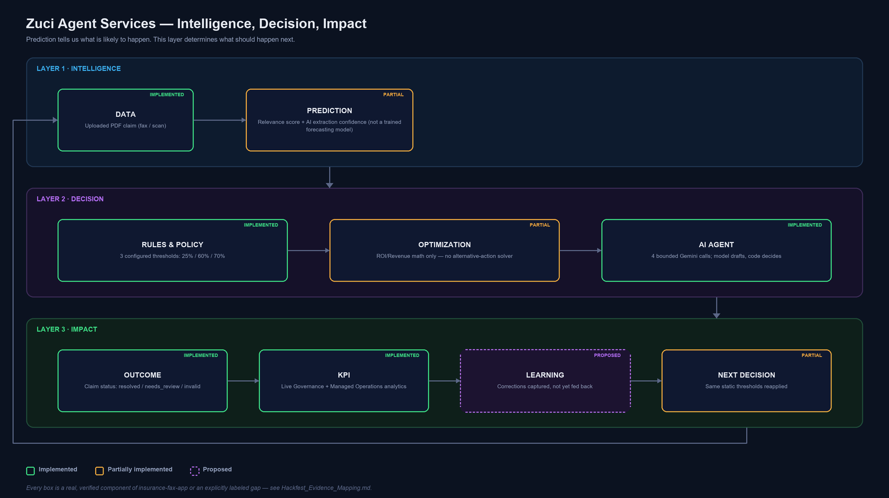
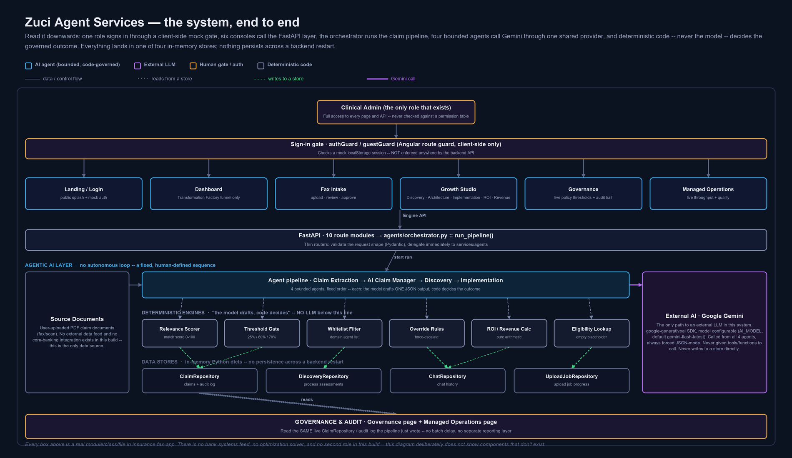
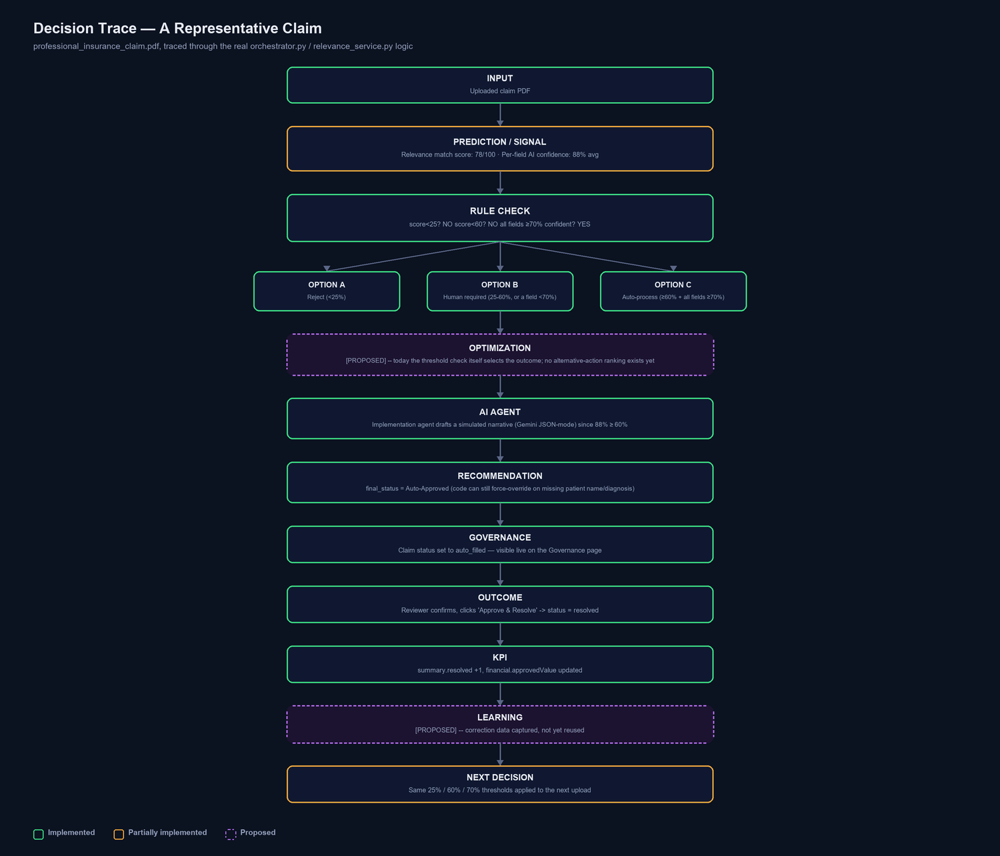
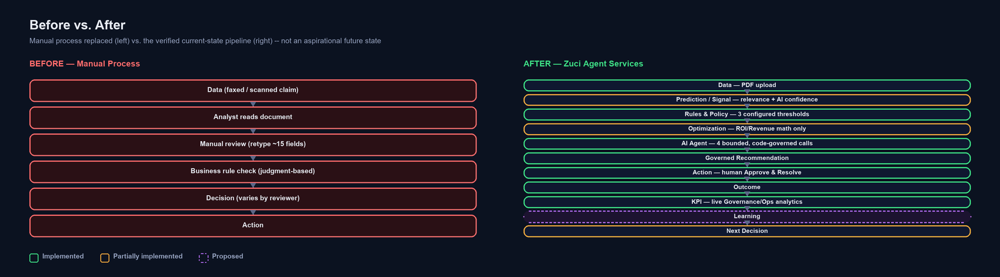

# From Prediction to Governed Action
### Zuci Agent Services — Agentic Prescriptive Analytics Hackfest Showcase

> **Grounding statement:** Every claim in this document traces to the `insurance-fax-app` repository (frontend: Angular 17.3; backend: FastAPI/Python; AI: Google Gemini). Labels — **[IMPLEMENTED]**, **[PARTIALLY IMPLEMENTED]**, **[PROPOSED]** — are applied strictly throughout. Nothing is invented to fit the narrative. This document combines the Executive Summary, the 10-page Showcase, the Technical Architecture, the Decision Trace, the Demo Script, and the Evidence Mapping into a single deliverable.

---

## 1. Executive Summary

**The message:** *Prediction tells us what is likely to happen. Our solution focuses on what should happen next.*

Zuci Agent Services processes insurance claim documents end-to-end — upload, AI-assisted extraction, source verification, policy-governed routing, and human-approved resolution — on a real Angular + FastAPI + Google Gemini stack, with zero external database (in-memory Python repositories).

**The story, in one line:** a computed signal (document relevance score + AI extraction confidence) is turned into a governed, explainable action through three configured policy thresholds and a repeated "AI drafts, deterministic code decides" pattern — proven four separate times in one working application, not once.

**What is proven [IMPLEMENTED]:**
- Real signal → policy → action pipeline (25% / 60% / 70% thresholds, `core/config.py`)
- Four bounded AI agents, each immediately checked by deterministic code (source-text grounding, whitelist filtering, confidence overrides)
- Live KPIs computed from the same claim data the pipeline just wrote — no batch delay (Governance, Managed Operations)
- Human-in-the-loop by construction — "Approve & Resolve" is the only path to a final decision

**What is honestly not yet built [PROPOSED]:**
- A trained prediction model (today's "signal" is computed per-document, not forecast from history)
- A true optimization step comparing alternative actions (ROI/Revenue tabs are fixed arithmetic, not a solver)
- A feedback/learning loop (corrections update only the current record)
- Multi-role RBAC and backend authentication (one mock role; the API is fully open today)

**The closed loop, mapped honestly:**

```text
DATA[implemented] -> PREDICTION[partial] -> RULES & POLICY[implemented] -> OPTIMIZATION[partial]
   -> AI AGENT[implemented] -> OUTCOME[implemented] -> KPI[implemented]
   -> LEARNING[proposed] -> NEXT DECISION[partial]
```

---

## 2. Current Business Problem

**Message:** Manual claim intake is slow, inconsistent, and stops at "here's a number" — a human still has to decide, unaided, what to do about it.

**Before (the actual manual workflow this application replaces):**

```text
DATA (faxed/scanned claim)
    |
ANALYST reads the document manually
    |
MANUAL REVIEW — retype up to 15 fields, cross-check by eye
    |
BUSINESS RULE CHECK — inconsistent, judgment-based, not codified
    |
DECISION — varies by reviewer, not recorded systematically
    |
ACTION
```

**Real pain points this application addresses:**
- A human must retype up to 15 fields per document (patient, policy, hospital, financial amounts).
- Faxed/scanned documents often have no text layer — ad hoc OCR or manual reading.
- Cross-checking a value against the source document is tedious and skipped under time pressure.
- No systematic way to catch a document with two conflicting values for the same field.
- "Is this even a valid claim?" is a subjective, reviewer-dependent judgment.
- No consistent, auditable policy for "auto-process vs. escalate vs. reject."

**SCREEN:** Fax Intake (`/queue/all`) — **PURPOSE:** shows the exact document a reviewer would otherwise process by hand. **DEMO ACTION:** upload a real sample claim PDF. **EXPECTED RESULT:** real per-stage progress labels, not a spinner. **BUSINESS MESSAGE:** "Every stage you see here replaces a manual step a reviewer used to do by hand."

---

## 3. What Existing Solutions Do

| Capability | What it provides | Remaining limitation |
|---|---|---|
| Descriptive analytics [IMPLEMENTED] | Live counts, status distribution, confidence buckets (Governance/Managed Operations) | Describes what happened — does not decide what to do next |
| Diagnostic analytics [IMPLEMENTED] | Per-field confidence, source-page citation, conflict flags | Explains why a value looks uncertain — still needs a policy to act on it |
| Predictive analytics [PARTIALLY IMPLEMENTED] | Document relevance score + AI extraction confidence, computed per document | Not a trained forecasting model over historical outcomes |
| Rule-based decision systems [IMPLEMENTED] | Three configured thresholds route every claim identically | Rules alone can't draft a narrative recommendation or reason over unstructured text |
| Workflow automation [IMPLEMENTED] | Async upload → extraction → routing pipeline | Automates the pipeline, not the judgment call within it |
| Generative AI [IMPLEMENTED] | Gemini drafts field values, chat answers, process assessments, simulated agent output | A draft is not a decision until deterministic code checks it |
| Agentic AI [PARTIALLY IMPLEMENTED] | Four bounded, code-governed AI touch points | No autonomous multi-step planning — a fixed, human-defined sequence only |

This is not a criticism of any single capability — each does its job well. The gap is that **none of them, alone, closes the loop from signal to governed action to measured outcome.**

---

## 4. What Gap Remains

**Prediction ≠ Decision.**

```text
Prediction / Signal
      |
Business Decision   <-- this step is where most systems leave a human unaided
      |
Action
      |
Outcome
```

| Missing link | Present here? |
|---|---|
| Context (already-extracted claim fields) | [IMPLEMENTED] |
| Eligibility check | [PARTIALLY IMPLEMENTED] — deterministic lookup exists, backing data table is an empty placeholder |
| Rules / Policy | [IMPLEMENTED] — three configured thresholds |
| Constraints (whitelist, override rules) | [IMPLEMENTED] |
| Optimization (compare alternative actions) | [PROPOSED] |
| Explainability | [IMPLEMENTED] — source-text citation, named thresholds |
| Human approval | [IMPLEMENTED] — "Review Anyway", "Approve & Resolve" |
| Governance / audit | [IMPLEMENTED] — live Governance page, audit log |
| Outcome measurement (KPI) | [IMPLEMENTED] |
| Feedback / Learning | [PROPOSED] |

The honest gap: **Optimization and Learning.** Everything else needed to turn a signal into a governed, explainable action already exists and is demonstrable live.

---

## 5. Our Solution — Agentic Prescriptive Analytics

**Message:** *"The innovation is not simply adding AI. The innovation is connecting signal, policy, and AI into a governed decision loop."*



| Stage | Real component | Status |
|---|---|---|
| Data | PDF upload, orchestrator pipeline | [IMPLEMENTED] |
| Prediction | Relevance score + extraction confidence | [PARTIALLY IMPLEMENTED] |
| Rules & Policy | Three config thresholds, domain whitelist | [IMPLEMENTED] |
| Optimization | Fixed-formula ROI/Revenue calculators only | [PARTIALLY IMPLEMENTED] / true optimization [PROPOSED] |
| AI Agent | 4 bounded Gemini-backed agents | [IMPLEMENTED] |
| Outcome | Claim status transition, decision endpoint | [IMPLEMENTED] |
| KPI | Governance/Managed Operations analytics | [IMPLEMENTED] |
| Learning | — | [PROPOSED] |
| Next Decision | Same static thresholds re-applied to the next claim | [PARTIALLY IMPLEMENTED] |

**Key message:** *"AI provides contextual reasoning; deterministic controls provide governance."* This is demonstrated four separate times in the codebase, not once.

---

## 6. End-to-End Architecture



**Verified technology stack** — Angular 17.3 (TypeScript, standalone components) · FastAPI (Python) · Google Gemini via `google-generativeai` · Tesseract OCR · PyMuPDF/pdfplumber · in-memory Python dictionaries (no database). **Not present, and not shown in any diagram:** Node.js, PostgreSQL/any SQL database, Azure OpenAI, OpenAI (non-Google), Redis, any ML framework, any optimization solver.

```text
Angular 17 Frontend (standalone components, lazy routes)
    |
FastAPI Backend -- 10 route modules, consistent error contract
    |
Orchestration -- agents/orchestrator.py :: run_pipeline()
    |
Decision Layer
    +-- Prediction/Signal: DocumentRelevanceService, ClaimExtractionService
    +-- Rules: core/config.py thresholds (25 / 60 / 0.70)
    +-- Policy: Discovery agent whitelist, Implementation override rules
    +-- Optimization: ROI/Revenue calculators (fixed formula, not a solver) [PARTIAL]
    +-- AI Agent: Gemini via one shared AIProvider abstraction, RuleBasedProvider fallback
    |
Action Layer -- claim status transition, human Approve & Resolve
    |
Outcome / KPI -- Governance + Managed Operations (live, real-data views)
    |
Feedback / Learning -- [PROPOSED] -- not implemented today
```

**The AI Provider Abstraction (the actual guardrail seam):** `services/ai/base.py` defines an abstract `AIProvider`, with two implementations — `GeminiProvider` (real calls, forced JSON-mode) and `RuleBasedProvider` (zero-dependency deterministic fallback). Every one of the four AI touch points calls through this same abstraction — there is exactly **one** code path to an external LLM in the whole application.

| AI touch point | File | Deterministic guardrail applied immediately after |
|---|---|---|
| Claim field extraction | claim_extraction_service.py | Source-text must literally appear in the document; cross-page conflict check |
| Grounded chat | chat_service.py | Cited source text must appear in the exact context sent, or the answer is discarded |
| Discovery assessment | discovery.py | Recommended agents filtered against a domain whitelist; rejects logged |
| Implementation simulation | implementation.py | Skip AI below 60% confidence; force-flag missing diagnosis; force review if no patient name |

**SCREEN:** Governance (`/governance`) — **PURPOSE:** proves the architecture's governance claim with live numbers, not a diagram. **DEMO ACTION:** open Governance immediately after resolving a claim. **EXPECTED RESULT:** decision-authority split changes in real time. **BUSINESS MESSAGE:** "This isn't illustrative — these are the exact thresholds enforced on the document you just uploaded."

---

## 7. Data → Prediction → Rules → Optimization → AI Agent → Outcome

**DATA [IMPLEMENTED]:** User-uploaded PDF claim documents (fax/scan) — the only data source; no external feed exists. Ingested via `POST /api/faxes/upload-async`, parsed by PyMuPDF/pdfplumber with a per-page Tesseract OCR fallback.

**PREDICTION [PARTIALLY IMPLEMENTED]:** Not a trained ML model. Two real, computed signals stand in for it: (1) `DocumentRelevanceService` — deterministic keyword-signal match score, 0–100; (2) per-field AI extraction confidence (Gemini JSON-mode, or rule-based fallback). Both are point-in-time, document-specific — not a forecast from historical outcomes.

**RULES & POLICY [IMPLEMENTED]:** Three configured thresholds (`core/config.py`): match score < 25 → reject; < 60 → human required; ≥ 60 with every field ≥ 70% confidence → auto-process. Discovery's domain-specific `AGENT_WHITELIST` and Implementation's override rules (skip AI below 60% confidence; force-flag missing diagnosis; force review if no patient name) are additional, code-enforced policy layers.

**OPTIMIZATION [PARTIALLY IMPLEMENTED / PROPOSED]:** Growth Studio's ROI and Revenue calculators are real, fixed-formula arithmetic — genuinely implemented, but this is estimation, not optimization. No solver compares alternative actions anywhere in the codebase. **How this can be extended:** the claim-context data already assembled for the AI Agent stage is the natural input to a future constrained-optimization step (e.g., prioritizing which needs-review claims a limited reviewer pool should work first, weighted by value/risk).

**AI AGENT [IMPLEMENTED]:** Four bounded agents — Claim Extraction, AI Claim Manager (grounded chat), Discovery, Implementation — each a single Gemini call followed immediately by a deterministic check. No autonomous multi-step loop; not claimed as such.

**OUTCOME [IMPLEMENTED]:** Claim status set to `auto_filled` / `needs_review` / `resolved` / `invalid`; the only way to `resolved` is an explicit human "Approve & Resolve."

**SCREEN:** Fax Intake claim detail — **DEMO ACTION:** click "View Source" on a field, then "Approve & Resolve." **EXPECTED RESULT:** source snippet highlighted; claim status becomes Resolved. **BUSINESS MESSAGE:** "Every value is traceable, and the human — not the model — makes the final call."

---

## 8. KPI → Learning → Next Decision

**KPI [IMPLEMENTED]** — real fields computed by `analytics_service.py`, not illustrative numbers:

| KPI | Source field | Business meaning |
|---|---|---|
| Total / Pending / Resolved / Invalid claims | `summary.*` | Volume and backlog at a glance |
| Total / Approved / Pending / Rejected claim value | `financial.*` (INR) | Financial exposure by state |
| Status distribution (%) | `statusDistribution` | Real, not hardcoded, percentage split |
| High / Medium / Low confidence fields | quality confidence buckets | Extraction reliability |
| Source-mapping success rate | quality success rate | % of fields with a verifiable citation |
| OCR required vs. completed | document analytics | Scan-quality operational load |
| Attention-required queue (HIGH/MEDIUM/LOW) | `attentionRequired` | Prioritized real work backlog |

**LEARNING [PROPOSED]:** A manager's field correction updates only the current claim record. It is **not** fed back into the extraction model, the three thresholds, or the agent whitelist. No expected-vs-actual outcome tracking exists. This is the clearest, most valuable next build item.

**NEXT DECISION [PARTIALLY IMPLEMENTED]:** The loop restarts at Data for the next uploaded claim, using the **same static thresholds** every time — the pipeline closes structurally, but not yet adaptively (thresholds don't tune themselves from outcomes).

**SCREEN:** Governance (`/governance`) → "Recent Decision Audit Trail" — **DEMO ACTION:** refresh after approving a claim. **EXPECTED RESULT:** decision-authority split and audit trail update immediately. **BUSINESS MESSAGE:** "No reporting lag — Governance reads the same store the pipeline just wrote."

---

## 9. Decision Trace — A Representative Scenario



This trace uses real configured values — a document with a 78/100 relevance score and 88% average field confidence clears both the invalid (25%) and review (60%) thresholds, so it auto-processes; the Implementation agent's AI call still runs (confidence ≥ 60%) to draft a simulated narrative, and code-level overrides remain active regardless (missing patient name/diagnosis would still force a review).

---

## 10. Before vs. After



The transformation is not hypothetical — every box on the right side of this diagram is a verified, working stage in the current codebase, each labeled with its real implementation status.

---

## 11. Governance and Responsible AI

**Implemented:**
- PDF upload validation (extension, content-type, size)
- Consistent typed-error → JSON contract; a catch-all handler prevents stack traces reaching the client
- Logging excludes raw document text/field values — metadata only
- Frontend route guards (`authGuard`/`guestGuard`) — client-side only
- Four separate, real AI guardrails (source-text grounding, whitelist filtering, confidence-threshold overrides)

**Not implemented — stated plainly:**
- No backend authentication or authorization of any kind — every API endpoint is fully open
- No RBAC — one mock role, never checked against a permission table
- CORS wide open (`allow_origins=["*"]`), an explicit development convenience
- No rate limiting on any endpoint, including the AI-backed ones
- No tamper-evident audit log — it is a plain in-memory list

**How this application prevents an AI model from making an uncontrolled decision:**

```text
AI Agent
   |
Recommendation (drafted JSON, not yet trusted)
   |
Rules / Policy Validation (source-text grounding / whitelist / confidence override)
   |
Approval / Controlled Action (human "Approve & Resolve", or automatic if thresholds clear)
   |
Audit Trail (in-memory log, visible on Governance)
```

The model never has a code path that writes to the claim record directly — it only ever populates a variable that governed code then validates, filters, or overrides before it is trusted.

---

## 12. Business Value + Innovation

- **Faster, consistent decisions** — one policy, applied identically, every time, not a judgment call that varies by reviewer.
- **From signal to action** — a confidence score doesn't just sit on a dashboard; it drives a real routing decision, in code.
- **Explainable by construction** — every value cites its source page; every routing decision names its threshold.
- **Repeatable governance pattern** — "model drafts, code decides" proven four times, not once, which is evidence it generalizes.
- **Augments, doesn't replace** — the architecture is designed to sit on top of existing predictive signals rather than requiring a rebuilt model.

---

## 13. Implemented vs. Proposed — Final Capability Matrix

| Capability | Status |
|---|---|
| PDF upload + async pipeline | [IMPLEMENTED] |
| OCR fallback | [IMPLEMENTED] |
| AI field extraction + rule-based fallback | [IMPLEMENTED] |
| Source verification / conflict detection | [IMPLEMENTED] |
| Policy-threshold routing | [IMPLEMENTED] |
| Human approval gate | [IMPLEMENTED] |
| Grounded AI chat | [IMPLEMENTED] |
| Agent whitelist enforcement | [IMPLEMENTED] |
| Confidence-based override rules | [IMPLEMENTED] |
| Live KPI / audit trail | [IMPLEMENTED] |
| Eligibility lookup | [PARTIALLY IMPLEMENTED] — deterministic, but backing table is empty |
| ROI / Revenue estimation | [IMPLEMENTED] (arithmetic, not optimization) |
| True optimization (alternative-action comparison) | [PROPOSED] |
| Feedback / learning loop | [PROPOSED] |
| Multi-role RBAC | [PROPOSED] |
| Backend authentication | [PROPOSED] |
| Trained prediction model | [PROPOSED] |

---

## 14. Hackfest Demo Script (10 minutes)

Narrative spine: **Problem → Why existing approach is not enough → Gap → Our innovation → How it works → Live demo → Business value → Closed-loop learning.**

| Time | Segment | What to show | What to say | Key message |
|---|---|---|---|---|
| 0:00–1:00 | Business Problem | — | "Every claims team still manually reads faxed documents, retypes fields, and decides case-by-case. That's slow, and inconsistent." | Prediction tells us what is likely; we show what should happen next |
| 1:00–2:00 | Existing Solution | Governance page | "Descriptive analytics, confidence scoring, generative AI drafting already exist here and work well." | We augment, not replace |
| 2:00–3:00 | The Gap | Architecture diagram | "A confidence score is not a decision — someone still has to decide, consistently, auditably." | Prediction ≠ Decision |
| 3:00–4:00 | Our Solution | Dashboard funnel | "Every stage of the decision journey is a real click, not five separate slides." | Connecting signal, policy, and AI into a governed loop |
| 4:00–6:00 | Live Demo | Fax Intake | Upload a real claim; narrate real per-stage progress; watch field-by-field auto-fill. | Every value is source-verified |
| 6:00–7:30 | Rules + Optimization + AI Agent | AI Claim Manager, Growth Studio → Implementation | Ask a quick action (no AI call) and an open-ended question (real Gemini call); simulate a low-confidence claim (forced escalation). | AI provides reasoning; deterministic controls provide governance |
| 7:30–8:30 | Recommendation + Governance | Governance page | "These are the exact thresholds — 25/60/70 — that just decided this claim." | Governance is a live read of enforcement code, not a slide |
| 8:30–9:15 | Outcome + KPI | Claim detail → Approve & Resolve → Governance | Approve the claim; refresh Governance; KPIs update live. | No batch delay — no batch layer exists |
| 9:15–10:00 | Learning + Next Decision | Closing remarks | "A correction today updates only that claim — closing the feedback loop is our clearest next build." | From isolated predictions to continuous decision intelligence |

**Presenter checklist:** backend healthy (`/api/health`) · logged in · a clean sample PDF plus a low-confidence one ready · `AI_API_KEY` configured (know how to unset it live) · at least one claim already processed so Governance isn't all-zero · the three thresholds memorized (25% / 60% / 70%) · the honest-gaps list rehearsed.

---

## 15. Evidence Mapping (Selected)

| Claim | Repository file | Status | Evidence |
|---|---|---|---|
| Three configured policy thresholds | config.py | [IMPLEMENTED] | Three named thresholds: 25 / 60 / 0.70 |
| Agent whitelist enforcement | discovery.py | [IMPLEMENTED] | Domain agent whitelist; rejected agents logged, never shown |
| Confidence-based simulation override | implementation.py | [IMPLEMENTED] | AI call skipped entirely below 60% confidence |
| Live KPIs | analytics_service.py | [IMPLEMENTED] | Summary, financial, quality, and document analytics fields |
| Eligibility lookup | mock_db.py | [PARTIALLY IMPLEMENTED] | Logic real; the backing table is an empty dict, always "Not Found" |
| True optimization | no file found | [PROPOSED] | No solver dependency anywhere in the codebase |
| Feedback / learning loop | no file found | [PROPOSED] | Corrections persist to the claim record only; not consumed elsewhere |
| Multi-role RBAC | auth.service.ts | [PROPOSED] | Single hardcoded mock role, never checked against a permission table |
| Backend authentication | no auth route exists | [PROPOSED] | Every FastAPI endpoint is unauthenticated |

*Full evidence table (25 rows) available in `Hackfest_Evidence_Mapping.md`.*

---

## 16. Final Takeaway

> "We are not pitching a new prediction model. We are showing the governed decision layer that sits on top of one — proven four separate times in a single working application — and we are naming, plainly, the two pieces (optimization and learning) needed to close the loop completely."
